# Project of Intelligent Systems
This report contains 10 summarized papers. The main topic is deep learning applied to robotics 

# Introduction

In the last few years, advances in technologies and research have had a great impact on the development of robotics. The robots are employed every day in a large variety of contexts. They substitute humans in those activities that can be performed more quickly and precisely. An example is manufacturing when the production process is automatized using artificial agents to improve productivity and reduce costs. In this case, the robots are fixed manipulators with a limited range of motions, that depends on where it is bolted down. This characteristic strongly limits the agent's possibilities. Generally, a fixed robot is programmed to perform a single precise task and it operates in a controlled environment. This means that the algorithm foresees every possible situation and often it is coded as a state machine. In contrast, mobile robots would be able to travel within the environment in which they operate, applying their talents wherever it is most effective. Thank mobility, the robotics applications become almost limitless. Some of them are healthcare, entertainment, and rescue. Mobile robots are also employed in those tasks that are impossible or too dangerous for humans, as the exploration of hostile environments: a building on fire, the seabeds, or the surface of another planet. These robots can be controlled by humans or can be autonomous. The firsts are controlled through remote controls while the seconds perceive the environment and move autonomously according to their task, without human intervention. The main problem that a mobile robot has to solve is how to move inside the environment. The first aspect is the *motion control*. Each robot has a different locomotion system, specific for the characteristics of the environment in which it moves. Given its low-level complexity, the motion actions are performed by a specific software component. To perform the motion control task is necessary to use the kinematics: the study of how the robot's mechanical systems behave. To define the kinematics of a robot, it is necessary to define a geometrical model (specific for the mechanical characteristics of the locomotion system) that allows expression of robot motion in a global reference frame and in the robot’s local reference frame. Using this notation, it is possible to define the robot's kinematics model that describes the movements and their constraints as a function. Through kinematics, it is resolved the significant challenge of *position estimation*. The next step is the *perception*. An autonomous system has to acquire knowledge about the environment. This is done by taking measurements using various sensors and then extracting information from those measurements. With this information, a mobile robot can determine its position in the environment. This activity is called *localization*. The last step for an autonomous mobile agent is *navigation*. Given partial knowledge about its environment and a goal position or a series of positions, navigation is the ability of the robot to act based on its knowledge and sensor values to reach its goal positions as efficiently and as reliably as possible. There are two main sub-task of navigation: *path planning* and *obstacle avoidance*. The first involves identifying a trajectory that will cause the robot to reach the goal location when executed. The second consists of modulating the trajectory of the robot in order to avoid collisions. Using the techniques explained before, an autonomous mobile robot is able to robustly navigate inside an environment to perform its tasks. However, a mobile robot operates in a highly non-deterministic context and the conventional algorithms often are not suitable or not robust enough. In the real world, in fact, there are a lot of different tasks that are too complicated to be modeled by a conventional algorithm. Some problems indeed may have a wide amount of data difficult to analyze. In this case, build a specific algorithm means to understand the complex patterns and the hidden correlations between the data. Instead, other tasks may be influenced by a lot of external factors that generate a large quantity of similar but different data. These factors are not easy to model, especially considered all together, and often they are not a priori known. This means that an algorithm performs well only in a controlled environment, that respects specific preconditions. On the other hand, if it is applied in the real world, the algorithm may encounter data that it cannot correctly analyze. A particular field of Computer Science is particularly suitable to solve these situations: *machine learning* (ML). It represents a family of algorithms that learn automatically through experience. These algorithms are not designed for a specific task but they are general purposes so they can be used to solve each type of task. The principle behind machine learning is the following: each real phenomenon can be modeled as an unknown mathematical function which can be approximate by a machine learning algorithm. In this work, the focus is posed on *deep learning* and its application to robotics. Deep learning is based on artificial neural networks, inspired by the biological neural network that composed the animal brains. In the following sections are resumed some papers that apply deep learning to robotics. Each of them specifies the article title, the name of the journal where it has been published, and the publication year. For each article is summarized the approach proposed, the innovation with respect to the literature and the achievements.

# The limits and potentials of deep learning for robotics

*THE INTERNATIONAL JOURNAL OF ROBOTICS RESEARCH 2018, Vol. 37(4–5) 405–420*

## Introduction

A robot is an inherently active agent that interacts with the real world and often operates in uncontrolled or detrimental conditions. Mistakes can lead to potentially catastrophic results, like put human lives at risk, e.g. if the robot is a driverless car. The application of deep learning in robotics, therefore, motivates research questions that differ from those typically addressed in other domains. How much trust can we put in the predictions of a deep learning system when misclassifications can have catastrophic consequences? How can we estimate the uncertainty in a deep network’s predictions and how can we fuse these predictions with prior knowledge and other sensors in a probabilistic framework? How can we generate enough high-quality training data? We can obtain these data in real-world scenarios or we can obtain them using data augmentation through simulation? Is there a fundamental difference between model-driven and data-driven problem-solving? This paper explores some of the challenges, limits, and potentials for deep learning in robotics.

## Challenges for deep learning in robotic vision

*Robotic vision* differs from *computer vision* in several aspects. In particular, the latter is a part of the first. A robot is an active agent that perceives the world with its different sensors, builds a coherent model of the world, and updates this model over time, but ultimately a robot has to make decisions, plan actions, and execute these actions to fulfill a useful task. In fact, for robotic vision, perception is only one part of a more complex system. In a simplified view, whereas computer vision takes images and translates them into information, robotic vision translates images into actions. This fundamental difference between robotic vision and computer vision motivates a number of research challenges along three conceptually orthogonal axes: *learning*, *embodiment*, and *reasoning*. We position individual challenges along these axes according to their increasing complexity, and their dependencies. 

### Learning challenges

Along this axis, we position challenges that are specific for (deep) machine learning in a robotic vision context.

**Uncertainty estimation**

It is important that deep learning systems can reliably estimate the uncertainty in their predictions. The robot has to treat a neural network in the same way as other sensors, also using Bayesian techniques to fuse the network’s predictions with prior knowledge to accumulate information over time. Typically a deep learning model returns scores that are not calibrated probabilities so not useable in a Bayesian sensor fusion framework. 

**Identify unknowns**

A common assumption in deep learning is that trained models will be deployed under *closed-set* conditions. However, robots often have to operate in ever-changing, uncontrolled real-world environments, and they will inevitably encounter data not covered by the training data. In these *open-set* conditions, it is crucial to identify unknowns with high confidence.

**Incremental learning**

A robotic vision system should be able to learn from new training samples of known classes during deployment, upgrading its internal representations accordingly.

**Class-incremental learning**

A robot, therefore, needs the capability to extend its knowledge and efficiently learn new classes of interest without forgetting the previously learned ones. Current techniques for class-incremental learning still rely on supervision in the sense that the user has to specifically tell the system which samples are new data.

**Active learning**

A robot should be able to select the most informative samples for incremental learning techniques on its own. In order to minimize the interaction with the humans, the robotic system can also comprise retrieving annotations from other sources such as the web.

### Embodiment challenges

**Temporal embodiment**

A robotic vision system perceives a stream of consecutive and therefore strongly correlated images. The potential of temporal embodiment to improve the quality of the perception process for object detection or semantic segmentation is currently rarely utilized. A robotic vision system that uses its temporal embodiment can, for example, accumulate evidence over time or exploit small viewpoint variation. A challenging aspect of the temporal embodiment is that the appearance of scenes changes over time. An environment can comprise dynamic objects which move inside it. Besides, an environment can also change its appearance according to different lighting conditions (day/night), structural changes in objects (summer/winter).

**Spatial embodiment**

The camera of a robotic system is spatially embodied and it will observe the scene according to the robot's movements. This fact poses both challenges and opportunities to a robotic vision system: it can help to disambiguate its semantic properties, improve depth perception, or segregate an object from other objects or the background in cluttered scenes. On the other hand, occlusions can alter or changes the visual perception. 

**Active vision**

One of the biggest advantages of a robot is the potential to control the camera, move it, and change its viewpoint independently from the robot's movements. In this way, a dynamic robotic vision system can improve its perception confidence, resolve ambiguities, and mitigate the effect of occlusions or reflections.

**Manipulation for perception**

As an extension of active vision, a robotic system could manipulate the scene to improve its perception. For example, a robot could move occluding objects or move an object to see its occluded faces.

### Reasoning challenges

Von Helmholtz (1867) formulated the idea that humans use unconscious reasoning when processing visual information, in order to inference concepts or make conclusions. The following searches investigate these unconscious mechanisms and reformulated them in a Bayesian inference framework.

**Reasoning about object and scene semantics**

The world around us contains many semantic regularities that humans use to aid their perception: objects tend to appear more often in a certain context, some objects tend to appear in groups, some objects rarely appear together in a scene, and so on. If these semantic regularities can be used by a vision system as prior knowledge, we can expect an improved and more robust vision framework.

**Reasoning about object and scene geometry**

Many applications in robotics require knowledge about the geometry of individual objects, or the scene as a whole. Estimating the 3D structure of scenes or objects from multiple views without having depth information is a widely researched topic. A robot, differently from a classical approach, has to perform this task in cluttered scenes, where the objects are not clearly separated. A robot needs the ability to express uncertainty in the inferred object shape and it should be able to exploits its embodiment to move the camera to collect new and more useful information. Inference over the geometry of the whole scene is related also to object-based simultaneous localization and mapping (SLAM).

**Joint reasoning about semantics and geometry**

The final reasoning challenge for a robotic vision system, therefore, is the ability to reason jointly about the semantics and the geometry of a scene. Semantics and geometry can help each other: a tightly coupled inference approach can be advantageous compared to two systems that work separately.

## The evaluation method for deep learning models applied to robotics

Normally the good deep learning performance is not reached when the models are used in real environments. The evaluation method used in computer vision fails when applied in robotics: a robot has to interact with a dynamic environment and not with a simple set of images downloaded from the Internet. When a statistic report indicates that a dataset has been solved, it does not necessarily mean that the problem itself has been solved. The available datasets often are not able to able to correctly evaluate the performance of a robotic deep learning model. One of the reasons is the datasets' inability to give to the model information about the unknowns aspect of real environments. In particular, *Open set recognition* refers to scenarios where incomplete knowledge of the world is present at training time. This implies that unknown classes can be submitted to the model during its operation. What is needed is a new class of machine learning algorithms that minimize the risk of the unknown. To do this, updated evaluation protocols are also needed. These protocols have to incorporate data that is both know and unknown to a model. Another important aspect is the systematic study of the performance of a recognition model across an exhaustive range of object appearances. To better understand this mechanisms, inner in the humans' visual system, psychophysics discipline can be used. Psychophysics investigates the relationship between physical stimuli and the sensations and perceptions they produce. This concept can be translated into the field of deep learning: we would like to know under what conditions a machine learning model is able to operate successfully, as well as where it begins to fail. But how exactly can Psychophysics be applied to deep models? One possibility is through a computational pipeline that is able to perturb the data at a massive scale (e.g. millions of images per image transformation being studied) and submit them to a model, studying its performance through the item–response curve. The key to interpreting the results is the ability to identify the model’s preferred view. The preferred view concept derives from vision science, which has established that humans possess an internalized canonical view (the visual appearance that is easiest to recognize) for individual object classes. Similarly, recognition models have one or more preferred views of an object class, each of which leads to a maximum (or minimum) score output. The psychophysics progresses support a growing trend in robotics and computer vision: simulation using rendered graphics. The models' performance can be assessed by comparing the respective item–response curves. Importantly, this technique can find potential gaps not only between different models but also between human and model behavior. Human performance vastly exceeds model performance even in cases where a problem has been assumed to be solved, especially comparing the item-response curves.

## The role of simulation for pixel-to-action robotics

*Deep reinforcement learning* is a new learning paradigm that is capable of learning end-to-end robotic control tasks, but its results have been demonstrated primarily in simulation, rather than on real robot platforms. Demonstrating learning capabilities on real robots remains a significant challenge: the long, data-hungry training paradigm of pixel-based deep robotic learning methods are too computationally hard to be executed by a robotic platform. On the other hand, in simulation, the training time can be greatly reduced by using dedicated hardware and parallelism paradigms. Another important difference that often separates a simulated task and its real-world analog concerns raw pixel inputs. One solution is to use transfer learning methods, but there exist fewer approaches for transfer from simulation to reality for robot domains. A possible solution consists of augmenting the target domain data with data from the source domain. Another approach is to use a "confusion" loss that forces the model to ignore data variations that separate the two domains. A more recent simulation-to-real solution relies on the *progressive network* architecture, which enables transfer learning through lateral connections that connect each layer of previously learned deep networks to new networks to model the gap between the two domains. The progressive networks advantages for simulation-to-real transfer are the following:

- the features learned for one task may be transferred to many new tasks;
- the columns may be heterogeneous, which may be important for solving different tasks, including different input modalities, or simply to improve learning speed when transferring to the real robot;
- progressive nets add new capacity, including new input connections, when transferring to new tasks. This is advantageous for bridging the reality gap, to accommodate dissimilar inputs between simulation and real sensors.

)

## Deep learning and physics-based models

The predominant approach to perception, planning, and control in robotics is to use approximate models of the physics underlying a robot, its sensors, and its interactions with the environment. These models require that their parameters are known with sufficient accuracy and can be tracked over time. This requirement poses overly challenging demands on system identification and perception, resulting in brittle systems. On the other hand, humans operate under intuitive rather than exact physical models. For this reason, they are capable of robustly performing a wide variety of tasks. Also, deep learning is moving in this direction: a lot of approaches forgot the use of explicit physics models, learning predictive models, and controls from raw experiences. Let's now confront the model-based and deeply learned approaches. Model-based approaches have wide applicability since the physics underlying them are universal. However, at the same time, the parameters of these models are difficult to estimate from perception. Deep learning, on the other hand, enables highly robust performance when trained on sufficiently large data sets but it does not have the general applicability of physics-based reasoning. Model-based approaches are significantly more data-efficient, related to their smaller number of parameters but the basin of convergence can be rather small. In contrast, deep learned solutions are often very fast and can have very large basins of convergence. However, they do not perform well if applied in a regime outside the training data. The following table resumes the principles just reported.

|                          | **Model-based**                                              | **Deep learning**                                           |
| ------------------------ | ------------------------------------------------------------ | ----------------------------------------------------------- |
| *Presentation*           | Explicit: based on or inspired by physics                    | Implicit: network structure and parameters                  |
| *Generality*             | Broadly applicable: physics are universal                    | Only in trained regime: risk of overfitting                 |
| *Robustness*             | Small basin of convergence: requires good models and estimates thereof | Large basin of convergence: highly robust in trained regime |
| Data efficiency          | Very high: only needed for system identification             | Training requires significant data collection effort        |
| Computational efficiency | Good in local regime                                         | Highly efficient once trained                               |

## Towards an automation of informatics

Deep learning will change the foundations of computer science. The successes of deep learning in various domains changing the algorithm design paradigm. While designing a specific algorithm requires a lot of experience and knowledge about the problem domain, machine learning techniques allow us to solve even a difficult task with little to no knowledge of the problem domain. 

**Programming versus data**

The programming paradigm is changing rapidly with the evolution of machine learning. In traditional computer science, human experts program problem-specific algorithms that require no additional data to solve a particular problem instance. On the other hand, a generic learning approach needs a large amount of data to find a computational solution automatically. The act of *programming* is replaced by *training* on the other end. The concept of the program is turned into the learning weights of the network. The programming language (the language in which a solution is coded), is replaced by network architecture, loss function, training procedure, and data.

**Does understand imply a precise approach?**

Computer programs reflect human understanding: a programmer has to understand the problem he is solving. If it is using deep learning techniques, we might say that less knowledge is required. The trend for a good programmer should be to understand the problem he is facing. To do this, often it needs to be able to use generic tools, such as deep learning, to discover problem structure. Furthermore, a programmer should understand how problems can be divided into parts: those parts for which we know the structure (and, therefore, can write algorithms for) and those for which we would like to discover the structure. 

**Generic tools might help us identify new structures**

As mentioned before, a programmer can use generic tools to acquire the knowledge needed to solve a problem and code a specific program. It might be difficult to extract this knowledge from a deep neural network but that should simply motivate researchers to develop methods for extracting this knowledge. This procedure is possible, as shown by recent experiments, but the extracted knowledge is really difficult to be used to design a specific algorithm. In addition, the neural networks further complicate this process: they simply memorize the training parameters, making so hard to extract the problem structure from them.

**Complex problems should be solved by decomposition and re-composition**

In many cases, interesting and complex problems will exhibit complex structures because they are composed of sub-problems. For many sub-problems, we already have excellent algorithmic solutions while, for many others, domain-specific programs are outperformed by deep neural networks. The re-composition can be achieved with differentiable versions of existing algorithms that are compatible solutions obtained with back-propagation

**Decomposability of problems**

A problem is called *decomposable* or *near-decomposable* if there is little complexity in the interactions among its sub-problems and most of the complexity is handled within those sub-problems. For example, the brain is not decomposable because the interactions between its components still contain much of the complexity of the original problem. Despite decomposition helps to dominate the problem complexity, this is not true for deep neural networks. In fact for end-to-end models giving up strict boundaries between sub-problems improves their solution. The authors suspect that there are optimal factorizations of problems for a defined task, agent, and environment. Despite this, factorization may not lead to simple interfaces between sub-problems but certainly facilitates finding an optimal solution.

**Automating programming**

Programming should be easy to automate. If we can successfully apply generic methods to complex problems, extract an algorithmic knowledge from the resulting solutions, use the resulting algorithms to solve sub-problems of the original problem, thereby making that original problem more easily solvable, and so forth, then we can also imagine an automated way of deriving computer algorithms from problem-specific data. A key challenge will be the automatic decomposition or factorization of the problem into suitably solvable sub-problems. This view raises some fundamental questions about the differences between *programs* in programming and *weights* in deep learning. Programs and weights, in this view, are different instances of the same thing: there is no qualitative difference between them. It seems plausible that when parameters are so specific we can call the program, but the reverse is also true. It is possible that other problems do not have algorithmic characteristics and can only be solved in a data-driven way.

**Priors to reduce the amount of data**

The process for acquiring the data can be very costly, especially when these data have to be acquired from interaction with the real world, as is the case in robotics. It will then become necessary to reduce the required amount of data by incorporating appropriate priors into learning. These priors reduce all possible interpretations of data to only those consistent with the prior. 

## Conclusions

The robotics community had accepted deep learning as a very powerful tool and begun to utilize and advance it. Despite this, the authors hope to see more integrated approaches in the future: robots that learn to utilize their embodiment to reduce the uncertainty in perception, decision making, and execution. Robots that learn complex multi-stage tasks. Robots that learn to discover and exploit the rich semantic regularities and geometric structure of the world. It is necessary to keep in mind that robotic perception, robotic learning, and robotic control are tasks that continue to pose severe challenges to the techniques typically applied.

# A Machine Learning Approach to Visual Perception of Forest Trails for Mobile Robots

*IEEE ROBOTICS AND AUTOMATION LETTERS, VOL. 1, NO. 2, JULY 2016*

## Introduction

This article studies the problem of perceiving forest or mountain trails from a single monocular image acquired from the viewpoint of a robot. Autonomously following a man-made trail is challenging for robotics. Many robot types, including wheeled, tracked, and legged vehicles, are capable of locomotion along real-world trails. Moreover, Micro Aerial Vehicles (MAVs) flying under the tree are a compelling and realistic option made possible by recent technological advances. One of the innovations introduced by this article is that the robot used for the experiments is a quadrotor: a drone with four rotors. In order to follow a trail, a robot has to perceive where the trail is, then react in order to stay on the trail. The robot input is a monocular image from a forward-looking camera. Perceiving real-world trails in these conditions is an extremely difficult and interesting pattern recognition problem. Computer Vision and Robotics literature mainly focused on paved road and forest/desert road perception. The latter is a significantly more difficult problem: unpaved roads are normally much less structured than paved ones. Their appearance is very variable and often boundaries are not well defined. In addition, their surface appearance can change very frequently, their shape and width are not as constrained, they often seamlessly blend with the surrounding area. Previous works deal with the task of perceiving trails as a segmentation problem, aiming to determine which areas of the input image corresponding to the image of the trail. To do this, it is necessary to classify the visual features that characterize a trail. All of these techniques are conceptually similar to image saliency. A *saliency map* is an image that shows for each pixel (of the original image) how much such pixel visually "stands out" from the rest. This information, which by itself is expected to be very noisy, is aggregated in order to infer the trail position and direction in the image. In this work, the authors follow a different approach and cast the trail perception problem as an image classification task. The robot estimates the approximate direction of the trail with respect to the direction of view by adopting a supervised machine learning approach based on Deep Neural Networks (DNNs). One of the advantages of DNNs for supervised image classification is generality: in fact, features are learned directly from data and do not have to be chosen or modeled by the algorithm developers for the specific problem. Deep learning is used also for obstacle avoidance. Previous work shows how imitation learning can be used to steer a quadrotor to avoid trees in an outdoor environment. The controller is previously trained by manually piloting the robot for a short time. However, the visual perception task is harder, requiring a more powerful classifier to be trained with a significantly larger training dataset obtained offline.

## Proposed method

### Problem formulation

The robot consists of a MAV with a monocular camera, fixed in front of it. The drone flies with a height similar to the average height of a person (approximately 1.7 meters). The input is an image acquired by the camera. The main goal is to remain on the trail analyzing the image using a deep learning module. There are considered three different classes which correspond to three different actions that the robot should implement in order to remain on the trail:

- **Turn Left (TL):** if $−90^{\circ} < \alpha < −\beta$; the trail is heading towards the left part of the image
- **Go Straight (GS):** if $−\beta \leq \alpha < +\beta$; the trail is heading straight ahead, at least in the close range
- **Turn Right (TR):** if $+\beta \leq α < +90^{\circ}$; the trail is heading towards the right part of the image

With $\beta = 15^{\circ}$. 

### Dataset

Recognize a trail is a very hard task and the learning machine needs a large and well-formed dataset to perform this task effectively. Such a dataset does not exist and the authors had to create it from scratch. A hiker was equipped with three head-mounted cameras: one pointing 30◦ to the left, one pointing straight ahead, and one pointing $30^{\circ}$ to the right. The fields of view of the three cameras partially overlap and cover approximately 180 degrees. The hiker then swiftly walks a long trail, by taking care of always looking straight along its direction of motion. The dataset is composed of the images acquired by the three cameras, labeled as follows: all images acquired by the central camera are of class GS, those acquired by the right camera are of class TL and the others (acquired by the left camera) make up the TR class. The dataset is composed of 8 hours of 1920 × 1080 30fps video acquired using three GoPro Hero3 Silver cameras and covers approximately 7 kilometers of hiking trails acquired at altitudes ranging from 300 m to 1200 m, different times of the day and weather. The dataset has been split into disjoint training (17,119 frames) and testing (7,355 frames) sets.

### Deep neural network

The authors implement the trail perception module as DNN (deep neural network), which is a feed-forward network built using successive pairs of convolutional and max-pooling layers, followed by several fully connected layers. To improve the network performances, the training set is augmented by synthesizing left/right mirrored versions of each training image. Additionally, mild affine distortions ($\pm10\%$ translation, $\pm5^{\circ}$ rotation, $\pm10\%$ scaling) are applied to training images to further increase the number of samples. The DNN is trained using backpropagation for 90 epochs, with a learning rate initially set to 0.005, then scaled by a factor of 0.95 per epoch. The free parameters (weights) are initialized with random numbers from a uniform distribution in the range $[−0.05, 0.05]$ and they are optimized using stochastic gradient descent. The network has an input layer formed by a matrix of 3 × 101 × 101 neurons. To fit with the input layer, the images are first anisotropically resized (with an anti-aliasing technique) to a size of 101 × 101 pixels. The pixels intensity are rescaled to the range $[-1, +1]$. The DNN's output layer has 3 neurons, one for each of the three classes TL, TR, GS.

### Experimental results

For the three-class classification problem, the absolute accuracy metric is computed to evaluate the model performances. To have a more robust performance evaluation, the authors consider a derived two-class classification problem. The resulting problem consists in determining if an image is of class GS or not. There are calculated accuracy, corresponding precision (the proportion of positive classifications that are actual positives), recall (the proportion of the actual positives that are identified correctly), and the area under the ROC curve. The authors compare the DNN performance to three alternatives:

- **Simple Saliency-based Model:** it is computed a saliency map of the input frame, based on the image hue. The saliency map is discretized to 16 × 9 blocks, and the average saliency for each block yields a 144-dimensional feature vector. An SVM model with an RBF kernel is learned from the training set to map this feature vector to the three-class: TL, GS, and TR.
- **The method by Santana et al:** this algorithm is explained in [12] and it is applied to the dataset images (50 iterations per frame). Its output trail soft segmentation is sampled at each of the testing frames.
- **Two human observers:** each of which is asked to classify 200 randomly sampled images from the testing set in one of the three classes.

The obtained results are reported it the following tables.

|              | **DNN** | **Saliency** | **[2]** | **Human1** | **Human2** |
| ------------ | ------- | ------------ | ------- | ---------- | ---------- |
| **Accuracy** | 85.2%   | 52.3%        | 36.5%   | 86.5%      | 82.0%      |

|               | **DNN** | **Saliency** | **[2]** | **Human1** | **Human2** |
| ------------- | ------- | ------------ | ------- | ---------- | ---------- |
| **Accuracy**  | 95.0%   | 73.6%        | 57.9%   | 91.0%      | 88.0%      |
| **Precision** | 95.3%   | 60.9%        | 39.8%   | 79.7%      | 84.0%      |
| **Recall**    | 88.7%   | 46.6%        | 64.6%   | 95.1%      | 81.6%      |
| **AUC**       | 98.7%   | 75.9%        | -       | -          | -          |

### Conclusion

The model has good performance, even when compared to those of humans. However, problems arise when applying this model in the real world. The authors implemented this model in a real drone, with a camera that captures frames with a resolution of 752 × 480 pixels. The main problem is the much lower image quality acquired by the quadrotors’ cameras as compared to the GoPro's images in the training dataset. This yielded a lower performance of the classifier compared to the testing dataset. This was especially apparent in situations with strong sky-ground contrast. Another problem is related to the trail width: the robot is often unable to negotiate trails if there is not enough free space beside the trail centerline. Despite this, on wide trails with even lighting conditions, the robot was able to successfully follow the trail for a few hundreds of meters.

# A Hybrid Compact Neural Architecture for Visual Place Recognition

*IEEE ROBOTICS AND AUTOMATION LETTERS, VOL. 5, NO. 2, APRIL 2020*

## Introduction

Performing visual place recognition (VPR) reliably is a challenge for any robotic system or autonomous vehicle operating over long periods in real-world environments. Convolutional neural networks (CNN) have been applied to the field of VPR with great success, typically using dedicated hardware: the GPUs. However, classical CNNs neglect any temporal information between consecutive images. However, sequence-based algorithms, such as SeqSLAM, matching two or more sequences of images to perform VPR. Two main deep learning models can be used to capture sequence patterns: *computer-science-oriented* and *neuroscience-oriented* models. In recent researches, recurrent neural networks (RNN) are used to reproduce the multi-scale spatial representation of an environment. While the results are promising, these computer-science-oriented systems are tested only in small synthetic environments, and the integration with neuroscience-oriented recurrent models such as continuous attractor neural networks (CANN) is not well explored. An attractor network is a network of nodes (i.e. neurons), often recurrently connected, whose time dynamics settle to a stable pattern. A pattern can be stationary, time-varying (i.e. cyclic), or chaotic. The particular pattern which network settles to is called its *attractor*. In neuroscience theory, different kinds of attractor neural networks have been associated with different functions, such as memory, motor behavior, and classification. More in detail, a continuous attractor network is a special type of attractor network, which models a non-linear dynamical system. A dynamical system consists of a *state place*, which its coordinates describe the state at any instance and a *dynamical role* that specifies the immediate future of all state variables. For example, the state of a pendulum is its angle and angular velocity, and the evolution rule is Newton's equation *F*=*m^a*. An *attractor* can be discrete (a discrete set of points) or continuous (a continuous object embedded in the state space).

In this work, the authors propose a hybrid neural network that incorporates both computer-science- and neuroscience-oriented models to perform the VPR task. Their approach comprises two key components: FlyNet, a compact neural network, and a 1-d CANN as a temporal model that encodes sequences of images to perform appearance-invariant VPR using real data. The resulting FlyNet+CANN model achieves competitive AUC results, but with far fewer parameters, minimal training time and smaller computational footprint than conventional deep learning and algorithmic-based approaches.

## Previous work

To design deep-learning-based models for VPR it is necessary to explore how this activity is performed by mammalians' brains and take inspiration from it. RatSLAM is an example, this method performs visual SLAM implementing the mechanisms using by rodents' brain. Other models perform VPR following the insect brains, like ants, bees, and flies, that exhibits the great capacity to navigate. Place recognition in insects is, however, most likely mediated by processing within the *mushroom bodies* (MB), a pair of structures involved in classification, learning, and recognition of both olfactory and visual information. Their structure has been similar to a multi-layer perceptron (MLP) network, which receives massive input signals from sensory lobes. These impressive capabilities, achieved with relatively small brains, make them attractive models for roboticists. For FlyNet, we take inspiration from algorithmic insights found in the fruit fly olfactory neural circuit. The authors investigate how it can be integrated with recurrent-based networks for the VPR task. Classical CNN models for image recognition have good performance but they have also undesirable characteristics. In fact, these networks are difficult to implement in a real robot, due to their size and complexity. In contrast, the authors propose the usage of compact neural models such as FlyNet to alleviate these requirements. To access and exploit the power of temporal information in many applications, researchers have developed a range of RNN. Another approach, implementing by RatSLAM, uses incorporated multi-dimensional CANN models with pre-assigned weights and structure. There exist other non-neural techniques, like SeqSLAM, that match sequences of pre-processed frames to provide an estimate of place. In this work, the authors attempt to develop a new bio-inspired, hybrid neural network for VPR tasks based on insect brain architectures such as FlyNet, which is extremely compact and can incorporate the filtering capabilities of a 1-d CANN to achieve competitive localization results.

## Proposed method

### FlyNet algorithm

The FlyNet proposed in this works is inspired by the *fly algorithm*. The Drosophila's small brain identifies odors by assigning similar neural activity patterns to similar input odors. The neural networks are composed of 4 layers (the input layer, two hidden layers, and the output layer). The network works as follows. A binary, sparse random matrix (*random projection*) connects the input layer to the second layer: each neuron receives and sums about 10% of the input neurons. This mechanism is also used to connect the second and third layers, but the number of neurons in the third layer is the same as the output one. Finally, using a WTA (winner-take-all) circuit, the third layer's neurons are mapped to the output layer, setting the first 5% with the high value to 1 and the rest to 0. The input layer generates a specific binary identifier for the input odor. The *FlyNet Algorithm* (FNA) proposed in this work is a mapping of the fly algorithm for vision purposes. The only difference is the WTA circuit, which is set to consider true the first 50% of the neurons with the high neurons.

### FlyNet models

The authors implement a range of VPR models, using FNA and a module with temporal filtering capabilities. These networks models are the following:

- **FlyNet:** it's composed by the FNA that terminates with a fully connected (FC) network. Its architecture is a three-layer MLP with 64–64–1000 units respectively, where the first two layers make up the FNA and the last one composes the FC network.
- **FlyNet+SeqSLAM:** it incorporates the SeqSLAM algorithm on top of our single-frame FlyNet network. This model can be compared along with the other following temporal models.
- **FlyNet+RNN:** It is a purely neural model that incorporates an RNN on top of FlyNet and terminates with another FC layer. Its architecture is the same as FlyNet (the FC layers have 100 units), with 512 recurrent units. 
- **FlyNet+CANN:** it incorporates a variation of the CANN architecture proposed in RatSLAM, which is a 1-dimensional model, on top of the FlyNet network. The CANN layer has 1002 units.

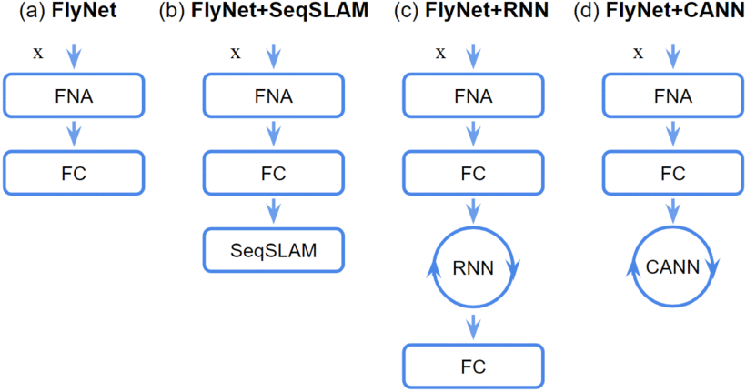

## Experiments

### Dataset and data preprocessing

To evaluate the capabilities of the proposed FlyNet-based models, the authors conduct extensive experiments on two of the most widespread benchmarks used in VPR, the *Nordland* and *Oxford RobotCar* datasets. Nordland includes extreme seasonal changes across spring, summer, fall, and winter, captured during a train journey, in northern Norway. The summer traversal is used for training, and the remaining for testing. The Oxford RobotCar dataset provides over 100 traverses with different lighting (e.g. day, night) and weather (e.g. direct sun, overcast) conditions through a car ride in Oxford city. The images are pre-processed before being used by the models. FlyNet baselines convert the images into single-channel (gray-scale) frames normalized between [0, 1], and then resize them to 32 × 64. 

### Experiments evaluation

The authors train and test the four FlyNet models in order to find the best model and compare it with other existing state-of-the-art techniques. In particular, these methods are *SeqSLAM* (without FNA attacked), *LoST-X*, and *Multi-Process Fusion*. 

#### Metrics

VPR models' performance is evaluated using precision-recall (PR) curves and area under the curve (AUC) metrics. The tolerance used to consider a query place as a correct match is being within 20 frames around the ground truth location for the Nordland dataset, and up to 50 meters (10 frames) away from the ground truth for the Oxford RobotCar dataset. 

#### Comparison of FlyNet to Other Neural Networks

FlyNet (alone) is compared with the other four single-frame models: a simple FC network, an FC network with dropout, a CNN, and an implementation of the NetVLAD method. The FC network has the same architecture as FlyNet: it is a three-layer MLP with 64-64-1000 neurons respectively. The FC network with dropout is the same as the previous one, but with a dropout rate of 90% and 50% for the first and second layers, respectively, in order to approximate the FlyNet sparsity and for fair comparison purposes. The CNN model has 2 convolutional layers while the NetVLAD output representation dimensionality is reduced from 4096 to 64 to be comparable in size with the FlyNet. 

## Experiments results

### FlyNet vs. Other Single-Frame Networks

FlyNet is directly competitive with both FC networks, despite FlyNet having over 3 times fewer parameters (64 k vs. 199 k). CNN and NetVLAD models, with 6 and 234 times more parameters than FlyNet respectively, the larger the model the better the results we obtained. Under *small environmental changes* (e.g. summer to fall) both networks achieved over 70% AUC. However, under *extreme visual changes* (e.g. summer to winter) all these models show relatively similar results, below 12% AUC, except for NetVLAD with 20% AUC.

### FlyNet models evaluation

Although there are significant performance differences at a single-frame matching level, the figure below shows that when using sequence-based filtering techniques these differences reduce significantly. For FlyNet+SeqSLAM, the performance of FlyNet (alone) was significantly improved. Similarly, the RNN layer on top of FlyNet improved even further these results. However, when integrating the output of FlyNet with a 1-d CANN we were able to outperform these models, even under extreme environmental changes: this is the best model.

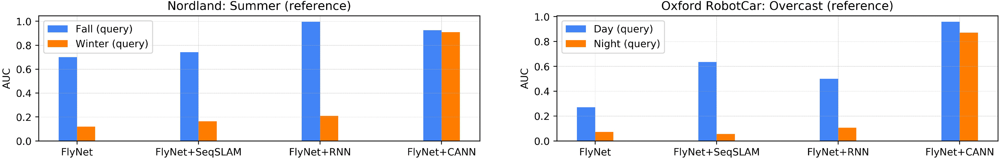

### Best model vs. state-of-the-art methods

MPF is performing better while being able to recall almost all places at 100% precision on both fall and winter testing traverses. FlyNet+CANN achieves state-of-the-art results, comparable with SeqSLAM and MPF in all these tested traverses.

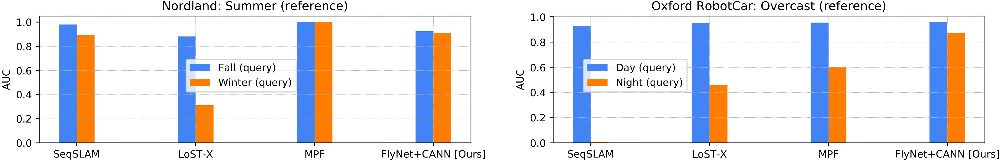

Similarly, PR performance on the Oxford RobotCar dataset is shown in the following figure. FlyNet+CANN not only achieves state-of-the-art results comparable with the other methods, but it maintains PR performance even under extreme environmental changes (e.g. overcast to night), as shown the bottom-right side of the figure.

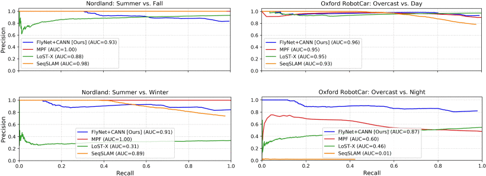

### Computational performance

The processing time required to perform appearance-invariant VPR by our hybrid model is compared to those from state-of-the-art methods in terms of running time for (1) feature extraction, (2) visual place matching between query and reference traverses, and (3) average place recognition time for a single query image from a 1000-image reference database. This Avg. Time (3) is calculated as (Feature Ext. (1) + Place Match. (2))/1000. Processing time results on the Nordland dataset are reported in the following table. The FlyNet+CANN can be up to 6.5, 310, and 1.5 times faster than MPF, LoST-X, and SeqSLAM, respectively.

| **Method**      | **Feature extraction** | **Place matching** | **Avg. time (fps)**  |
| --------------- | ---------------------- | ------------------ | -------------------- |
| **FlyNet+CANN** | **35 sec**             | **25 sec**         | **0.06 sec (16.66)** |
| MPF             | 1.9 min                | 4.6 min            | 0.39 sec (2.56)      |
| LoST-X          | 110 min                | 200 min            | 18.6 sec (0.05)      |
| SeqSLAM         | 50 sec                 | 40 sec             | 0.09 sec (11.11)     |

The following figure shows the comparison between the networks' complexity and the results obtained, viewing the AUC metric for the most challenging appearance change (day to night). The best model proposed in this works obtains the best results with the minimum number of parameters.

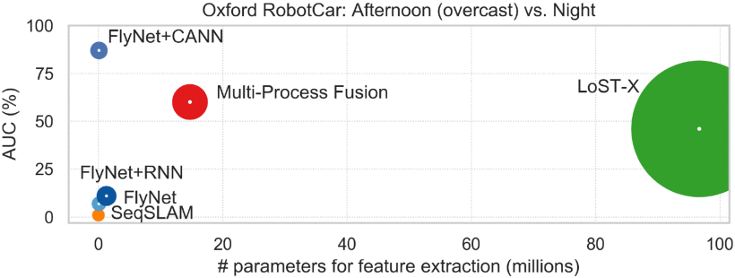

## Conclusions

FlyNet+CANN model achieves competitive visual localization results compared to existing deep learning and algorithmic-based VPR techniques, but with significantly fewer parameters, a smaller footprint, and reduced processing time. The authors want to demonstrate that, taking inspiration from the biological brain, it is possible to build sample-efficient, high-performing VPR models. FlyNet has the same number of layers and sparse structure found in the fly olfactory neural circuit. Despite the fly, brains extend by forty times the dimensionality of the inputs, the authors have experimentally shown that also reducing this dimension the FlyNet training accuracy remained around 96%. At the same time, FlyNet+CANN enabled the use of a relatively low-performance but fast network to get better VPR results, which is also able to generalize across challenging environmental changes.

# A Multimodal Target-Source Classifier With Attention Branches to Understand Ambiguous Instructions for Fetching Daily Objects

*IEEE ROBOTICS AND AUTOMATION LETTERS, VOL. 5, NO. 2, APRIL 2020*

## Introduction

In the last few years, the domestic service robots (DSRs) have become more popular: they have a lot of different and useful functions and they can help people with disabilities. Despite this, one of the main limitations of DSRs is their inability to naturally interact through natural language. This ability may be appreciated by non-expert users. A particular task like various expressions relating to an object for fetching tasks. This work focuses on *multimodal language understanding for fetching instructions* (MLU-FI). This task consists of predicting a target instructed in natural language, such as "*Bring me the yellow box from the wooden cabinet.*". The purpose is to understand how to extract instructions for robots from natural-language expressions. Natural language induces ambiguity because of the many-to-many mapping between the linguistic and physical world which makes it difficult to accurately infer the user’s intention. In this work, the authors propose the multimodal target-source classifier model with the attention branch (MTCM-AB) which is an extension of the MTCM (proposed in [5]), with the addition of the attention branch network (ABN) explained in [6]. The MTCM module predicts the region-wise likelihood of target and source candidates in the scene. Unlike other methods, MTCM can handle region-wise classification based on linguistic and visual features. The ABN is an image classifier, inspired by class activation mapping (CAM) structures, that generates attention maps. This line of research focuses on the production of image masks that, overlaid onto an image, highlight the most salient portions with respect to some given query or task. An attention map is an image with highlighted the salient regions of a given label. Multiple visual attention networks were also proposed in recent years for solving visual question answering. However, most of these approaches use only a single modality for attention: visual attention. By contrast, recent studies in multimodal language understanding have shown that both linguistic and visual attention is beneficial for the given task.

## Problem definition

The aim is to predict a target referred by an initial instruction among a set of candidate targets in a visual scene. Instructions are not constrained which is more natural but increases the complexity of the comprehension task because users may use referring expressions to characterize a target. Examples of possible instruction can be: "*Take the Kleenex box and put it in the bottom right box*" or "*Go to the kitchen and take the tea bottle on the upper shelf*". To address the MLU-FI are considered:

- **Input:** a fetching instruction as a sentence in addition to an image of the scene. 

- **Output:** the most likely target-source pair. The terms target and source are defined as follows. 

  - **Target:** a daily object (e.g. bottle or snacks) that a user intends the robot to fetch.
  - **Source:** the origin of the target (e.g. desk or cabinet).

The evaluation metric is the prediction accuracy over the top-1 target prediction. Ultimately this study does not focus on object detection. The authors suppose that the bounding boxes of the target and source are given in advance. The MTCM-AB is not specifically designed for a given scene or context. It is validated on two types of datasets, in real and simulated environments described below.

- **Home Environment:** In this configuration, the experiments use a simulation-based dataset from the Partner Robot Challenge Virtual Space (WRS-PV). WRS-PV depicts home environments as represented in the figure below. The three-dimensional environments (Unity-based) are augmented to make them more realistic. In this environment, a targeted DSR, that is HSR (Human Support Robot), can freely navigate and manipulate objects. In this context, the MTCM-AB predicts the most likely target among several candidates.
- **Pick-and-Place Scene:** the PFN-PIC [7] dataset is designed for pick-and-place tasks from an armed robot with a top-view camera. The scene consists of four boxes, in which several candidate targets (up to 40) are randomly placed.

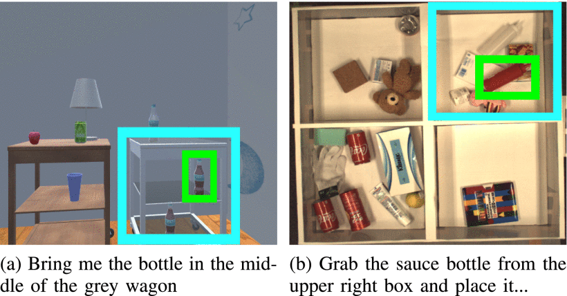

## Proposed method

The proposed method consists of target prediction with respect to instruction in natural language. The authors extend the MTCM [5] with an attention branch network (ABN, [6]) that are used to improve the prediction from the linguistic and visual inputs. In ABN, the class attention map (CAM) network is extended to produce an attention mask for improving image classification. The ABN is decomposed into parallel branches to avoid deteriorating the classifier accuracy (both of them are classifiers):

* an attention branch that produces attention maps and
* a prediction branch that predicts the likelihood of some label.

The MTCM-AB module produced in this work, similarly to the MTCM, predicts the target and source from the full sentence. This module is composed of a set of sub-modules: the Target Attention Branch (TAB), the neighboring Context Attention Branch (nCAB), and the Linguistic Attention Branch (LAB). The MTCM-AD architecture is explained in detail in the following line and the figure below is a visual representation of it. The MTCM module works as follow:

* **Input:** for each target candidate $i \in \{1, . . ., N\}$ and source $i^{'} \in \{1, . . ., M\}$, the input is 

  $\begin{equation*} {\bf x}(i)=\lbrace {\bf x}_{l}(i), {\bf x}_{t} (i), {\bf x}_{c} (i), {\bf x}_{r} (i) \rbrace, \end{equation*}$ 

  where ${\bf x}_l(i)$, ${\bf x}_t(i)$, ${\bf x}_c(i)$ and ${\bf x}_r(i)$ denote linguistic, target, context and relation features. The authors purposefully omit index in the following, that is, ${\bf x}(i)$ is then written as ${\bf x}$. More in detail, the input variables define:

  * ${\bf x}_t(i)$: it is defined as the cropped image of the target
  * ${\bf x}_c(i)$: it is a cropped image that characterizes a target and its neighborhood (context)
  * ${\bf x}_c(l)$: it consists of sub-word vector embedding
  * ${\bf x}_r(i)$: it is a vector characterizing the position of the target candidate in the environment.

* **Linguistic Attention Branch (LAB):**  its purpose is to emphasize the most salient part of the linguistic features for instruction comprehension. The LAB module is composed by a implementation of the BERT method for the sub-word embedding (extract the words internal structure). Subsequently, the multi-layer Bi-LSTM network is used to obtain a latent space representation of the extracted linguistic features. The last hidden states of each layer are concatenated to form *linguistic feature maps* f~l~, from which a linguistic attention mask is extracted. Feature maps f~l~ are processed through one-dimensional convolutional layers followed by a single fully connected layer (FC) The *linguistic attention map* a~l~ is obtained from the second convolutional layer that is convoluted with an additional layer and normalized by a sigmoid activation function. The output visual feature maps are then obtained using a masking process given by

  $\begin{equation*} {\bf o}_{l}= {\bf a}_l \odot {\bf f}_{l} \end{equation*}$

  where $\odot$ denotes the Hadamard product (takes two matrices of the same dimensions and produces another matrix of the same dimension as the operands where each element $i, j$ is the product of elements $i, j$ of the original two matrices).

* **Target Attention Branch (TAB):** it produces an attention map for the candidate target images. The input ${\bf{x}_t}$ is transformed into a space feature ${\bf{f}_t}$ through a CNN, which is processed into FC layers. Even in this case, a visual attention map is extracted from the second FC layer that is processed in a parallel branch composed of a FC layer and a sigmoid activation function. Output latent space feature o~t~ is then obtained by 

  $\begin{equation*} {\bf o}_{t}= {\bf a}_t \odot {\bf f}_{t}. \end{equation*}$

* **Neighboring Context Attention Branch:  (nCAB):** it is one of the main novelties of the MTCM-AB. nCAB module adds an attention branch mechanism to focus on the relevant part of the image in the surroundings of a given target, in order to define context features. An extended cropped image (${\bf x}_c$) is extracted from around the target. This input is encoded into feature maps ${\bf{f}_c}$ from a CNN feature extractor. The convolutional layers are followed by a global average pooling (GAP). In parallel, context attention map a~c~ is created from an additional convolution and sigmoid normalization of the third convolutional layer. The output context feature maps are given by 

  $\begin{equation*} {\bf o}_{c}= {\bf a}_{c} \odot {\bf f}_{c}. \end{equation*}$

* **Perception Branch:** it is composed by a visual multi-layer perceptron (MLP), which encodes the concatenation of ${\bf{o}_t}$, ${\bf{o}_v}$ and ${\bf{x}_r}$. In parallel, a linguistic MLP encodes linguistic features ${\bf{o}_l}$. The source is predicted as ${\bf{J}_{src}}$ from a third MLP that combines the two previous MLP outputs.

* **Loss Functions:** the MTCM-AB is trained by minimizing several embedding loss functions related to the different branches. In particular, it minimizes the global loss function $J_{total} = \lambda_cJ_c + \lambda_tJ_t + \lambda_lJ_l + \lambda_pJ_p + \lambda_{src}J_{src}$, where J~i~ is the loss function for the branch i and $\lambda_i$ are loss weights that are defined in the experimental section.

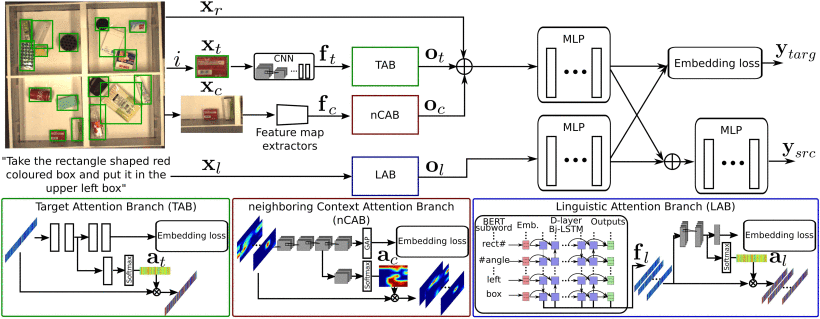

## Experiments

The proposed method is evaluated over the PFN-PIC and WRS-PV datasets. The first contains 89,891 sentences in the training set and 898 sentences in the validation set to instruct 25,861 targets in the training set and 532 targets in the validation one. The latter, instead, has 308 images from which 2015 instructions in the training set and 74 instructions in the validation set. The experimental setup is summarized in the following figure. This configuration is used to train the model with the PFN-PIC dataset, while for the WRSPV dataset the learning rate was decreased to 5 × 10−5 and a batch size of 64.

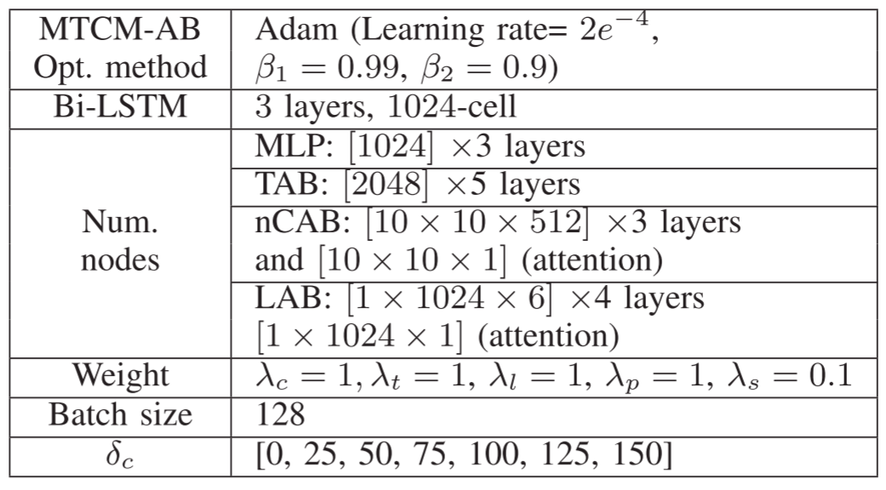

The input images were downscaled to 299 × 299 before being processed. The parameter $\delta_c$ represents the variation in size of the context input ${\bf x}_c$. It corresponds to the size of the cropped image target to which is added $\delta_c$ in width and height. The MTCM-AB had 27.5 M parameters.

## Results

### Quantitative results

The *quantitative results* correspond to the accuracy obtained for the most likely target predicted, given an instruction. This metrics is also called *top-1 accuracy*. The authors report the performance variation with varying sizes of ${\bf x}_c$ by setting $\delta_c$ with a 0 to 150-pixel wise extension, to find the best value of.  $\delta_c$These results are reported in the following figure. 

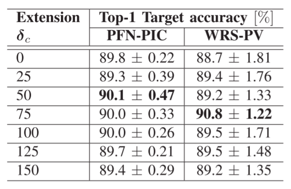

From $\delta_c$ analysis, the authors found its best value for the two datasets, which is, respectively, 50 and 75 pixels for the PFN-PIC and WRS-PV datasets. In addition, this analysis shows that the PFN-PIC dataset is highly cluttered with relatively small objects, because setting $\delta_c = [125, 150]$ causes lower accuracy than the configuration with $\delta_c = 0$. The MTCM-AB method proposed in this work is compared with respect to other state-of-the-art models and human performance, which is considered as an upper bound. These confront models are the MTCM [1] and its baseline method explained in [7] by Hatori et al. The results, in terms of top-1 accuracy, are reported in the following figure.

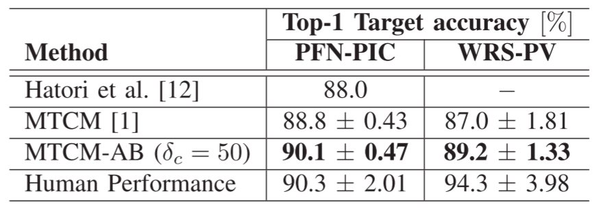

On PFN-PIC, the MTCM-AB outperformed the MTCM and baseline method by 1.3% and 2.1% respectively. The results of WRS-PV corroborated the trend observed on the PFN-PIC dataset. To characterize the contribution of each attention branch, the authors also report the results of an ablation study for the PFN-PIC dataset. These results, showed in the following figure, show that both linguistic and visual attention branches improved the prediction accuracy compared to the MTCM.

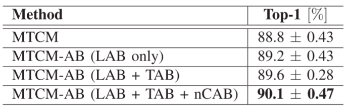

### Qualitative Results

In the following figure, the *qualitative results* are reported for the PFN-PIC dataset. In the first row, the prediction is given in blue while the ground truth is in green. The attended region of each context feature ${\bf x}_c$ is given in the second row. The two first columns refer to correct predictions. The third column refers to an erroneous prediction (wrongly attended target), while the last column refers to an erroneous prediction due to incorrect ground truth ("brown pack" is instructed but "can" is given the label). The sentences are:

- "*Take the blue sandal move it to lower left box*"
- "*Take the green item next to the pair of white gloves and move it to top left box*"
- "*Move the grey colored bottle at top left to box below*".
- "*Pick the brown pack and put it in lower left box*"

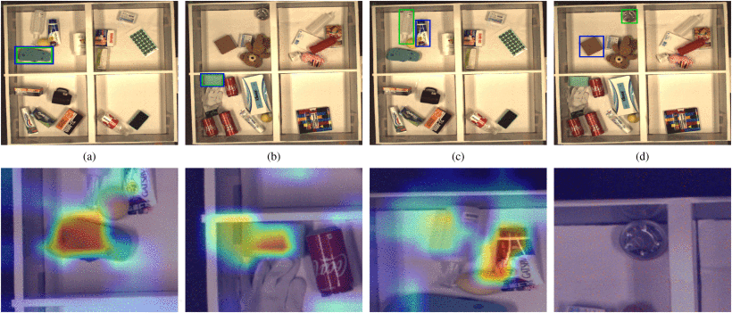

Qualitative results on the WRS-PV dataset are analyzed in the same way. The three first samples illustrate correct predictions with consistent attended regions. The last sample, with the instruction "Take an apple on the same shelf that a coffee cup is placed" is erroneous and our model predicts the cup instead of the apple.

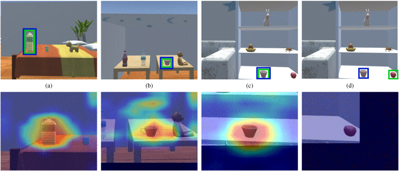

### Error Analysis

Analysing the MTCM-AB results, different failure cases can be observed:

* **ES (erroneous sentence):** the ground truth does not correspond to the target specified in the instruction
* **NE (negation):** the ground truth is specified from a negation sentence which is thought to be difficult to solve in NLP community
* **REL (relation to landmark):** the ground truth is defined with respect to landmark objects and the predicted target position is incorrect with respect to this landmark
* **RES (relation to source):** the ground truth target is defined with respect to a source and the predicted target position is incorrect with respect to this source
* **SE (source error):** the instruction specifies a given source and the predicted target position is in a different source

## Conclusions

The MTCM-AB extends the MTCM, achieving higher accuracy. In addition, multimodal attention achieves higher accuracy than monomodal attention on linguistic or visual inputs.

# CNN Based Road User Detection Using the 3D Radar Cube

*IEEE ROBOTICS AND AUTOMATION LETTERS, VOL. 5, NO. 2, APRIL 2020*

## Introduction

Radars are attractive sensors for intelligent vehicles as they are relatively robust to weather and lighting conditions (e.g. rain, snow, darkness) compared to camera and LIDAR sensors. They also have excellent range sensitivity and can measure radial object velocities directly using the Doppler effect. A radar outputs a point-cloud of reflections called *radar targets* in every frame and each radar target has the following features: range $r$ and azimuth $\alpha$, radar cross section RCS (i.e. reflectivity), and the object’s radial speed $v_r$ relative to the ego-vehicle. The authors call these feature *target-level*. Many radar-based road user detection methods first cluster radar targets by their *target-level* features. Object detection and classification methods depend on the success of this initial classification step. Other methods explore using the *low-level radar cube* given by early processing of the radar signal. The radar cube is a 3D data matrix with axes corresponding to range, azimuth, and velocity (also called Doppler). In contrast to the target-level data, the radar cube provides the complete speed distribution (i.e. Doppler vector) at multiple 2D range-azimuth locations. Such distributions can capture modulations of an object’s main velocity caused by its moving parts, e.g. swinging limbs or rotating wheels. In this work, the authors show that these data can be used as valuable features for object classification. The features derived from a 3D cube are called *low-level*. This work focus only on addressing moving road users. In *Prophet*, proposed in [10], radar targets are first clustered into objects by DBSCAN. Then, several cluster-wise features are extracted, e.g. the variance/mean of $v_r$ and $r$. The performance of various classifiers (Random Forest, Support Vector Machine (SVM), 1-layer Neural Network, etc.) were compared in a single-class (pedestrian) detection task. The Schumann method [11] also uses clusters calculated by DBSCAN as the base of a multi-class (car, pedestrian, group of pedestrians, cyclist, truck) detection, but extract different features, e.g. deviation and spread of α (azimuth). In this letter, the authors propose a radar-based, multi-class moving road user detection method, which exploits both expert knowledge at the *target-level* (accurate 2D location, addressed phase ambiguity), and *low-level* information from the full 3D radar cube rather than a 2D projection. The method's core is a Convolutional Neural Network (CNN) called Radar Target Classification Network (*RTCnet*). The inclusion of low-level data enables the classification of individual radar targets before any object clustering; the latter step can benefit from the obtained class scores.

## Proposed method

*RTCnet* classifies each target individually based on the fused low-level and target-level data. The network consists of three parts. The first encodes the data in spatial domains (range, azimuth) and grasps the surroundings’ Doppler distribution. The second is applied to this output to extract class information from the distribution of speed. Finally, the third part provides classifications scores by two fully connected layers (FC). The output is either multi-class (one score for each class) or binary. In the latter case, an ensemble voting step combines the result of several binary classifiers. A class-specific clustering step (i.e. the radar targets’ predicted class information is used) generates an object list output. The following figure shows an overview of our method. 

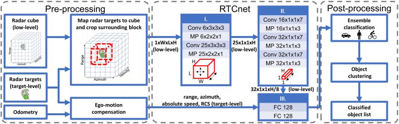

### Pre-Processing

Every single frame of radar targets and a single frame of the radar cube (low-level data) is fetched and pre-processed. First, radar targets with low compensated (absolute) velocity are considered as static and are filtered out. Then, corresponding target-level and low-level radar data are connected. Next, we look up each remaining dynamic radar target, such as a grid cell in the radar cube based on their reported range, azimuth, and (relative) velocity ($r$, $\alpha$, $v_r$). Afterward, a 3D block of the radar cube is cropped around each radar target’s grid cell with radius in range/azimuth/Doppler dimensions ($L$, $W$, $H$).

### Network

The *RTCnet* structure can be seen in detail in the figure above. The network is composed of three modules:

* **Down-Sample Range and Azimuth Dimensions:** it aims to encode the radar target’s spatial neighborhood’s Doppler distribution into a tensor without extension in range or azimuth. In other words, it transforms the 1 × $W$ × $L$ × $H$ sized data to a $C$ × 1 × 1 × $H$ sized tensor (sizes are given as Channel × Azimuth × Range × Doppler), where C was chosen as 25. To do this, it contains two 3D convolutional layers (Conv) followed by two maxpool layers (MP).
* **Process Doppler Dimension:** the aim of this module is to extract class information from the speed distribution around the target. It operates on the output of the first which is 25 × 1 × 1 × $H$. To do this, two 1D convolutions along the Doppler dimension are applied, each of them is followed by a maxpool layer. The output of this module is a 32 × 1 × 1 × $H/8$ block.
* **Score Calculation:** The output of the second module is flattened and concatenated to the *target-level* features ($r$, $\alpha$, $v_r$, $RCS$) and used by this module. It uses two fully connected layers with 128 nodes each to provide scores. The output layer has either four nodes (one for each class) for multi-class classification or two for binary tasks.

### Ensemble Classifying

It is possible to train the third module to perform multi-class classification directly. It implements also an ensemble voting system of binary classifiers, in the case of the network has two output nodes. This module is trained as One-vs-All (OvA) and One-vs-One (OvO) binary classifiers for each class (e.g. car-vs-all) and pair of classes (e.g. car-vs-cyclist), 10 in total. 

### Object Clustering

To obtain proposals for object detection, the authors cluster the classified radar targets with DBSCAN incorporating the predicted class information. The radar targets with bike/pedestrian/car predicted labels are clustered in separate steps. As a metric, we used a spatial threshold $\gamma_{xy}$ on the Euclidean distance in the $x, y$ space, and a separate speed threshold $\gamma_v$ in velocity dimension. The advantage of clustering each class separately is that no universal parameter set is needed for DBSCAN. The authors use different parameters for different classes, e.g. larger radius for cars and small ones for pedestrians. Furthermore, swapping the clustering and classification step makes it possible to consider objects with a single reflection. The following figure reports three challenging cases  for the cluster classification:

* **A:** objects may be clustered together (red circle)
* **B:** large objects may be split up into several clusters
* **C:** object with only one reflection

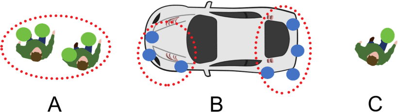

To address this, the method performs a filtering on the produced object proposals, calculating their spatial, velocity, and class score distribution distances. If two clusters have different classes and are close enough in all dimensions, they are merged the smaller class to the larger (i.e. pedestrians to cyclists and cars, cyclists to cars).

### Dataset

The dataset is obtained in the real-world with a demonstration vehicle during a time of an hour. There are recorded both the target-level and low-level output of our radar, the output of a stereo camera (1936 × 1216 px), and the vehicle’s odometry (filtered location and ego-speed). Annotation was fetched automatically from the camera sensor using the Single Shot Multibox Detector (SSD) [9]. Then, the mislabeled ground truth are corrected manually. To further extend the training dataset, the authors augmented the data by mirroring the radar frames and adding a zero-mean, 0.05 std Gaussian noise to the normalized *r* and *v~r~* features. Training and testing sets are from two independent driving (33 and 31 minutes long) which took place on different days and routes. The validation set is a 10% split of training dataset after shuffling.

## Experiments

The proposed method is tested in two different experiments:

* **Experiment 1:** the classification task's performances are examined. As target-wise metric, a true positive is a correctly classified target. For cluster-wise methods, the predicted label of a cluster is assigned to each radar target inside it. Furthermore, the authors also performed an ablation study to see how different features benefit the method. *RTCnet (no ensemble)* is a single, multi-class network to see if ensembling is beneficial. *RTCnet (no RCS)* is identical to RTCnet, but the RCS target-level feature is removed to examine its importance. Similarly, in *RTCnet (no speed)* the absolute speed of the targets is unknown to the networks, only the relative speed distribution (in the low-level data) is given. Finally, *RTCnet (no low-level)* is a significantly modified version as it only uses target-level features.

* **Experiment 2:** this experiment consists of comparing the methods in object detection task, examining the entire pipeline. Predictions and annotations are compared by their intersection and union calculated in number of targets. A true positive is a prediction which has an Intersection Over Union (IoU) bigger than or equal to 0.5 with an annotated object. Further detections of the same ground truth object count as false positives. To better understand this metric, see the figure below.

  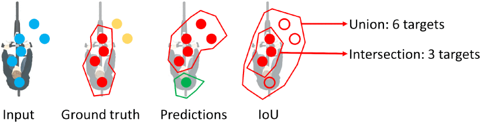

We selected Schumann [11] as a baseline because it is the only multi-object, multi-class detection method found with small latency. Also, *Prophet* [1] is selected as a baseline. Since the DBSCAN parameters are sensor-specific, the following table shows the optimal parameters for the two baselines and for the class-specific clusters. Both baselines method has the parameter *v~min~*, used to find the static radar targets.

| **Method**               | *$\gamma_{xy}$* | **$\gamma_v$** | ***Min Points*** | **$v_{min}$** |
| ------------------------ | --------------- | -------------- | ---------------- | ------------- |
| *Prophet*                | 1.2 $m$         | 1.3 $m / s$    | 2                | 0.4 $m / s$   |
| *Schumann*               | 1.3 $m$         | 1.4 $m / s$    | 2                | 0.4 $m / s$   |
| Class specific: peds.    | 0.5 $m$         | 2.0 $m / s$    | 1                | -             |
| Class specific: cyclists | 1.6 $m$         | 1.5 $m / s$    | 2                | -             |
| Class specific: cars     | 4.0 $m$         | 1.0 $m / s$    | 3                | -             |

For two baselines, the classifiers consists of a Random Forest with 50 trees. The size of the cropped block are set to $L = W = 5, H = 32$. The speed threshold to filter out static objects is a sensor-specific parameter and was set to 0.3 *m / s* based on empirical evidence. The thresholds to merge clusters during object clustering were set to 1 $m$ spatially, 0.6 for scores, 2  $m / s$for pedestrian to cyclist, and 1.2 $m / s$ for pedestrian/cyclist to car merges. The input data are normalized to be zero-mean and have a standard deviation of 1.

## Results

### Experiments results

The results of *experiment 1* (target classification) are presented in the following table.

| **Method**              | **Pedestrian** | **Cyclist** | **Car**  | **Other** | **Avg**  |
| ----------------------- | -------------- | ----------- | -------- | --------- | -------- |
| *Prophet*               | 0.61           | 0.58        | 0.34     | 0.91      | 0.61     |
| *Schumann*              | 0.67           | **0.68**    | 0.46     | **0.92**  | 0.68     |
| *RTCnet (no low-level)* | 0.56           | 0.63        | 0.33     | 0.90      | 0.61     |
| *RTCnet (no speed)*     | 0.66           | 0.63        | 0.36     | 0.91      | 0.64     |
| *RTCnet (no RCS)*       | **0.71**       | 0.66        | 0.48     | 0.91      | 0.69     |
| *RTCnet (no ensemble)*  | 0.67           | 0.65        | 0.47     | 0.89      | 0.67     |
| *RTCnet*                | **0.71**       | 0.67        | **0.50** | **0.92**  | **0.70** |

*RTCnet* outperformed the two cluster-wise baselines reaching an average score of 0.70. *Schumann* has slightly better results on cyclists than *RTCnet* (0.68 vs 0.67) but performs significantly worse on pedestrians (0.67 vs 0.71) and cars (0.46. vs 0.50). The ablation study showed that removing each feature yields worse results than the complete pipeline, with the exception of *RTCnet (no RCS)* which has an average of 0.69. The results also show that classification performance changes over the distance from the target object and the vehicle, based on the number of samples in the training set. The figure below shows this fact.

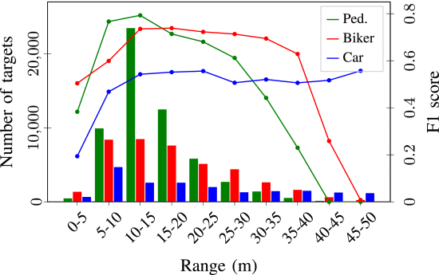

For *experiment 2* (object detection), the results are shown in the following table.

| **Method** | **Pedestrian** | **Cyclist** | **Cars** | **Avg.** |
| ---------- | -------------- | ----------- | -------- | -------- |
| *Prophet*  | 0.48           | 0.50        | 0.23     | 0.40     |
| *Schumann* | 0.54           | **0.60**    | 0.31     | 0.48     |
| *RTCnet*   | **0.61**       | 0.59        | **0.47** | **0.56** |

*RTCnet* reached slightly worse results on cyclists than *Schumann* (0.59 vs 0.60), but significantly outperformed it on pedestrians (0.61 vs 0.54), cars (0.47 vs 0.31), and in average (0.56 vs 0.48). 

### Discussion

The proposed method outperformed the baselines in target classification mainly due to two reasons. First, the classification does not depend on a clustering step. This allows us to handle objects that contain a single radar target (a common occurrence, especially for pedestrians) and mitigates the difficult cases shows in the figure above. Second, the method uses the low-level radar data, which brings the information of the speed distribution around the radar target. To demonstrate that this inclusion is beneficial, the authors show that only using target-level data and only the third module of the network (*RTCnet (no low-level)*) caused a significant drop in performance from 0.70 to 0.61 average score. The results of RTCnet (no low-level) and RTCnet (no speed) prove that the relative velocity distribution (i.e. the low-level radar data) indeed contains valuable class information. Despite the radar's performances are uniform in darkness/shadows/bright environments, its typical errors are shown in the following figure. Radar is easily reflected by flat surfaces (e.g. side of cars) acting like mirrors, creating ghost targets. 

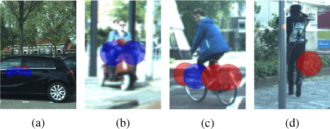

The combination of the proposed network and the clustering step outperformed the baseline methods in the object detection task. This is mainly because by swapping the clustering and classifying steps, classes can be clustered with different parameters. This is mainly because by swapping the clustering and classifying steps, classes can be clustered with different and more appropriate parameters.

## Conclusions

In extensive experiments on a real-life dataset, the authors showed that the proposed method improves upon the baselines in target-wise classification by reaching an average score of 0.70 (vs. 0.68 *Schumann*). Furthermore, the importance of low-level features and ensembling in an ablation study is demonstrated. Furthermore, the authors show that the proposed method outperforms the baselines overall in object-wise classification by yielding an average score of 0.56 (vs. 0.48 *Schumann*).

# CorsNet: 3D Point Cloud Registration by Deep Neural Network

*IEEE ROBOTICS AND AUTOMATION LETTERS, VOL. 5, NO. 3, JULY 2020*

## Introduction

In computer vision, pattern recognition, and robotics, *point set registration*, also known as *point cloud registration*, is the process of finding a spatial transformation (*e.g.,* scaling, rotation and translation) that aligns two point clouds. The 3D point cloud is a recently popular data format. The most popular and classic method for point cloud registration is the iterative closest point (ICP) algorithm [13]. ICP calculates the rigid motion based on a fixed correspondence between one point cloud and another, updating the correspondence to minimize the point-to-point distances. Although ICP can achieve highly accurate registration, the registration often fails by falling into the local minimum. In other words, the registration accuracy of ICP depends strongly on its initial perturbation. Despite this, the inherent lack of structure has caused difficulties when adopting point clouds as direct input in deep learning architecture. PointNet [14], overcomes these difficulties, providing a mechanism to extract the feature related to the point clouds. PointNet is a general representation of an unstructured point cloud that allows object detection, segmentation, and so on. PointNetLK [15] is the latest deep learning-based registration techniques using PointNet [2]. PointNetLK directly optimizes the distance of aggregated features using the gradient method. This approach overcomes computational speed and local minimum problems. In this paper, "DirectNet" is proposed as a baseline method as it is a simplistic approach. However, the authors think that PointNetLK and DirectNet do not consider local features, falling to fully utilize the point cloud information. In this work, CorrespondenceNet (CorsNet) is proposed. It is a novel point cloud registration method based on deep learning is proposed. This method feeds global features from PointNet to per-point local features to make effective use of point cloud information. The end-to-end network architecture consists of the main three parts: (1) extracting global features of point clouds with PointNet, (2) concatenating global features with local features of the source point cloud and outputting the correspondences of each point via fully connected layers and (3) estimating a rigid transform with singular value decomposition (SVD). The SVD part is also included in the end-to-end network architecture. The singular value decomposition is a factorization of a matrix $m \times n$. Given the matrix here $\mathbf {M}_{m\times n}$, $\mathbf{M} = \mathbf{U}\Sigma\mathbf{V}$. It $\mathbf {M}$ is used in a geometrical operation, the same result can be obtained applying these three matrices in succession. In particular, $\mathbf {U}_{m\times n}$ is an orthogonal matrix that applies a rotation,  $\Sigma_{n\times n}$ is a diagonal matrix that scales only the axes and  $\mathbf {V}_{n\times q}$ is another orthogonal matrix that applies another rotation.

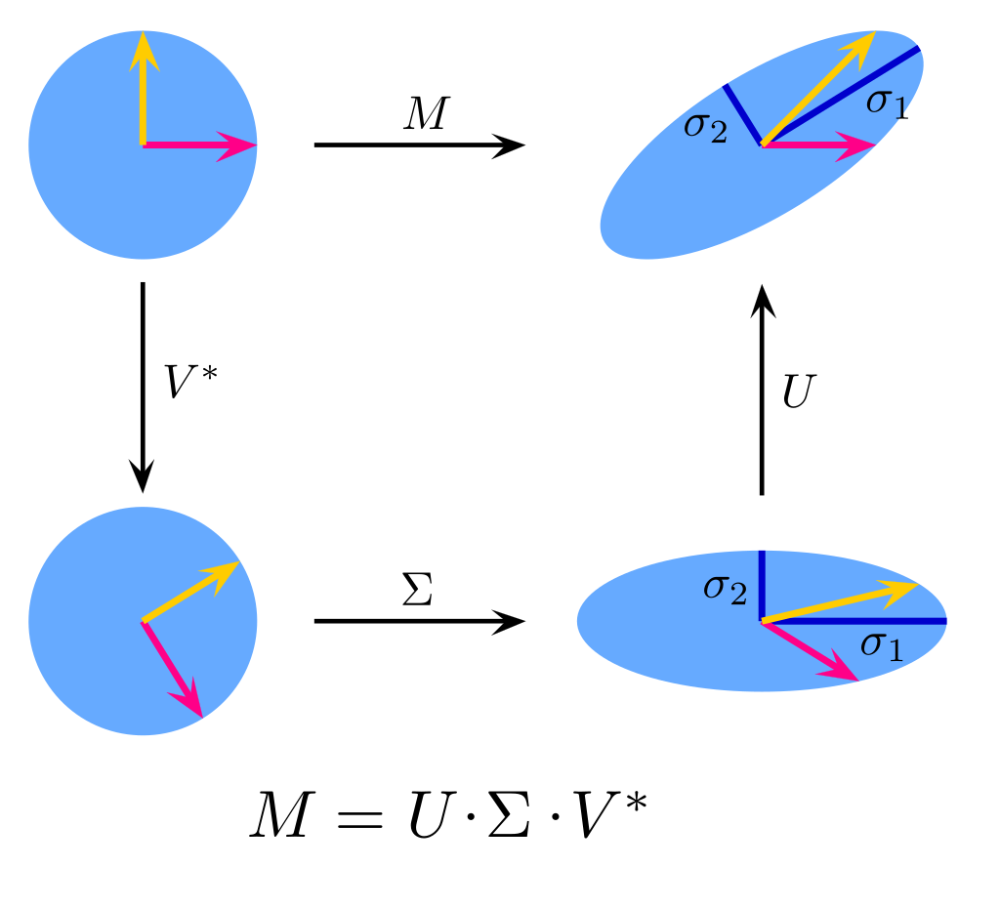

## Proposed method (CorsNet)

A point cloud is represented as a set of 3D points $\{P : P_i|i = 1, . . ., n\} \subset R_3$ whose each point $P_i$ is a vector of its $(x, y, z)$ coordinate. The following figure shows the CorstNet architecture.

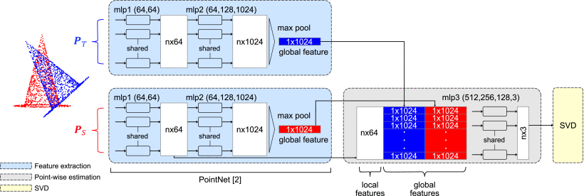

The red $\boldsymbol{P}_S$ and blue $\boldsymbol{P}_T$ point clouds represent the *source* and *template* point clouds, respectively. We find the rigid transform $\boldsymbol{G} \in SE$, which includes the alignment between $\boldsymbol{P}_S$ and $\boldsymbol{P}_T$. The model mainly consists of three components:

* **Global feature extraction:** this first module extract the point cloud's features. These features must include three factors: invariance in order, acquisition of local feature, and invariance in rotation. PointNet is used to absolve this goal. It satisfying these three requirements and it has achieved high accuracy and low computational complexity in various benchmarks. The PointNet output is a 1 × 1024 vector obtained by a max-pooling of two MLP (multi-layer perceptron). The features are extracted both for the source and template point clouds.

* **Correspondence estimation:** after computing the global features of the source and template point cloud, this module finds the point local features by concatenating the global feature with each of the point features. The network output is t $\Delta\boldsymbol{P}_S$, a $n × 3$ matrix. By adding this $\Delta\boldsymbol{P}_S$ to $\boldsymbol{P}_S$, the tentative transform destination can be calculated as follow:

  $\begin{equation*} \hat{\boldsymbol {P}_T} = \boldsymbol {P}_S + \Delta \boldsymbol {P}_S \end{equation*}$

  This method regresses correspondences $\Delta\boldsymbol{P}_S$ and estimates a rigid transform based on the estimated correspondences using SVD

  $\begin{equation*} \boldsymbol {G}\cdot \boldsymbol {P}_S= \boldsymbol {P}_T \end{equation*}$

* **SVD:** the source point cloud is now aligned with the template point cloud and the following is the approach for calculating a rigid transformation using SVD as follows.

  Define the centroids of $\boldsymbol{P}_S$ and $\hat{\boldsymbol{P}_T}$ as:

  $\begin{equation*} \overline{\boldsymbol {P}_S} = \frac{1}{n}\sum ^{n}_{i=1}\boldsymbol {P}_S \;\;\; \text{and} \;\;\; \overline{\hat{\boldsymbol {P}_T}} = \frac{1}{n}\sum ^{n}_{i=1}\hat{\boldsymbol {P}_T} \end{equation*}$

  and calculate the cross-covariance matrix H:

  $\begin{equation*} \boldsymbol {H}= \sum ^{N}_{i=1}\left(\hat{\boldsymbol {P}_T}-\overline{\hat{\boldsymbol {P}_T}}\right)\left(\boldsymbol {P}_S-\overline{\boldsymbol {P}_S}\right)^{T}.  \end{equation*}$

  Then, use SVD to decompose $\boldsymbol{H}$ to $\boldsymbol{U},\boldsymbol{V} \in SO$

  $ \begin{equation*} [\boldsymbol {U}, \boldsymbol {S}, \boldsymbol {V}]= SVD (\boldsymbol {H}). \end{equation*}$

  and, using this decomposition, extract the rigid transform elements, estimated rotation, $\boldsymbol{R}_{est}\in SO$ and translation, $\boldsymbol{t}_{est} \in \R^3$

  $\begin{align*} \boldsymbol {R}_{est} &= \boldsymbol {V}\boldsymbol {U}^{T}.\\\boldsymbol {t}_{est} &= - \boldsymbol {R}\cdot \overline{\hat{\boldsymbol {P}_T}} + \overline{\boldsymbol {P}_S}. \end{align*}$

  Now, it is possible to calculate the estimated rigid transform $\mathbf{G}_{est}$ and the twist parameters $\mathbf{\xi}_{est} \in \R^{6}$ as follow:

  $\begin{align*} \boldsymbol {G}_{est} &= \left(\begin{array}{cc}\boldsymbol {R}_{est} & \boldsymbol {t}_{est} \\ \boldsymbol {0} & 1 \end{array} \right). \\ \boldsymbol {\xi }_{est} &= \phi \left(\boldsymbol {G}_{est} \right). \end{align*}$

The dataset used to test the proposed method is called ModelNet40 [16]. From this, the source point clouds ($\boldsymbol{P}_S$) are extracted and the ground-truth estimated rigid transform ($\boldsymbol{G}_{gt}$) can be defined as:

 $\begin{equation*} \boldsymbol {P}_{T} = \boldsymbol {G}_{gt}\cdot \boldsymbol {P}_{S}.\end{equation*}$

Now, we call $\boldsymbol{Cors}$ the correspondence between two point clouds, in particular:

$\begin{align*} \boldsymbol {Cors}_{gt} &= \boldsymbol {P}_{T} - \boldsymbol {P}_{S}. \\ \boldsymbol {Cors}_{est}& = \hat{\boldsymbol {P}_{T}} - \boldsymbol {P}_{S}. \end{align*}$

Subsequently, we define three kinds of loss elements using previously values:

$\begin{align*} \boldsymbol {loss}_{1} &= ||(\boldsymbol {G}_{est})^{-1}\cdot \boldsymbol {G}_{gt} - \boldsymbol {I}_{4}||_{F}. \\ \boldsymbol {loss}_{2} &= ||\boldsymbol {\xi }_{gt}-\boldsymbol {\xi }_{est}||^{2}. \\ \boldsymbol {loss}_{3} &= ||\boldsymbol {Cors}_{gt} - \boldsymbol {Cors}_{est}||^{2}. \end{align*}$

From them, four loss functions are defined as follow:

$\begin{align*} \boldsymbol {Loss}_{v1}& = \boldsymbol {loss}_{1}. \\ \boldsymbol {Loss}_{v2}& = \boldsymbol {loss}_{2}. \\ \boldsymbol {Loss}_{v3}& = \boldsymbol {loss}_{1} + \boldsymbol {loss}_{3}.\\ \boldsymbol {Loss}_{v4}& = \boldsymbol {loss}_{2} + \boldsymbol {loss}_{3}.  \end{align*}$

The authors verified the effectiveness of each loss function in the experiments.

## Proposed method (DirectNet)

The authors proposed a novel method which directly regresses the pose, including rotation $\boldsymbol{R}_{euler} ∈ \R^3 $ (Euler angle) and translation $\boldsymbol{t} ∈ \R^3$, as shown in the following figure. 

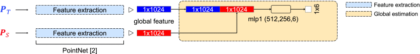

DirectNet consists of two parts: the global feature extraction module, which is identical to CorsNet (that is PointNet), and the global estimation part. The $\boldsymbol{P}_S$ and $\boldsymbol{P}_T$ global features extracted with PointNet are concatenated and converted to 1 × 6 vector. The output 1 × 6 vectors is $[x_{euler}, y_{euler}, z_{euler}, x_{t}, y_{t}, z_{t}]^T$. The first half of this vector is represented as $\boldsymbol{R_{euler}} = [x_{euler}, y_{euler}, z_{euler}]^T$ . This $\boldsymbol{R_{euler}}$ is converted into $\boldsymbol{R_{est}} \in SO $ as follows:

$\begin{align*} \boldsymbol {x}_{mat}& = \left(\begin{array}{ccc}1 & 0 & 0 \\ 0 & \cos x_{euler} & -\sin x_{euler} \\ 0 & \sin x_{euler} & \cos x_{euler} \end{array} \right). \\ \boldsymbol {y}_{mat} &= \left(\begin{array}{ccc}\cos y_{euler} & 0 & \sin y_{euler} \\ 0 & 1 & 0 \\ -\sin y_{euler} & 0 & \cos y_{euler} \end{array} \right). \\ \boldsymbol {z}_{mat} &= \left(\begin{array}{ccc}\cos z_{euler} & -\sin z_{euler} & 0 \\ \sin z_{euler} & \cos z_{euler} & 0 \\ 0 & 0 & 1 \end{array} \right). \\ \boldsymbol {R}_{est}& = \boldsymbol {x}_{mat} \cdot \boldsymbol {y}_{mat} \cdot \boldsymbol {z}_{mat} \end{align*}$

The last part, instead, define the translation vector $\boldsymbol{t_{est}}$ as 

$\begin{equation*} \boldsymbol {t}_{est} = [x_{t}, y_{t}, z_{t}]^{T}. \end{equation*}$

Using $\boldsymbol {R}_{est}$ and $\boldsymbol {t}_{est}$ is possible to determine $\boldsymbol {G}_{est}$ and $\boldsymbol {\xi}_{est}$ as done for CorsNet. For DirectNet two loss functions are formulated:

$\begin{align*} \boldsymbol {Loss}_{v1} &= ||(\boldsymbol {G}_{est})^{-1}\cdot \boldsymbol {G}_{gt} - \boldsymbol {I}_{4}||_{F}. \\ \boldsymbol {Loss}_{v2} &= ||\boldsymbol {\xi }_{gt}-\boldsymbol {\xi }_{est}||^{2}.  \end{align*}$

## Experiments

The proposed method CorsNet is compared with ICP and PointNetLK, DirectNet (described in this work). 

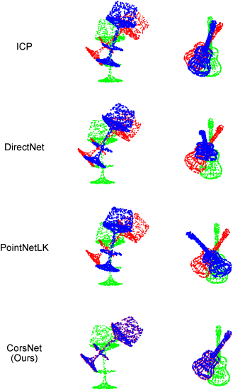

The dataset used is ModelNet40, which includes various point clouds with 40 categories. The point clouds' coordinates are normalized to be in the $[0, 1]^3$ interval and the points of each model's surface are sampling to be exactly 1024. The authors measure the root mean square error (RMSE) of rotation $\boldsymbol{R}$ and translation $\boldsymbol{t}$ for each experimental setting. The first experiment consists into evaluate the models using the same categories. 20 categories from the dataset were chosen and they are used for both training and testing of all networks. CorsNet and DirectNet were trained using all the losses reported in the sections above. The authors chose a ground-truth transformation ($\boldsymbol{G}_{gt}$) randomly by an interval of $[0, 45]$ degrees for rotation and $[0, 0.8]$ for translation. The following table shows the evaluation results of all models, using all possible loss functions.

| **Method (loss type)**             | **RMSE ($\boldsymbol{R}$)** | **RMSE ($\boldsymbol{t}$)** |
| ---------------------------------- | --------------------------- | --------------------------- |
| ICP                                | 46.4628                     | 0.26144                     |
| DirectNet $\boldsymbol{Loss}_{v1}$ | 19.4791                     | 0.01218                     |
| DirectNet $\boldsymbol{Loss}_{v2}$ | 20.9916                     | 0.01690                     |
| PointNetLK                         | **14.9746**                 | 0.01690                     |
| CorsNet $\boldsymbol{Loss}_{v1}$   | 18.6482                     | 0.01574                     |
| CorsNet $\boldsymbol{Loss}_{v2}$   | 17.9941                     | 0.00725                     |
| CorsNet $\boldsymbol{Loss}_{v3}$   | 18.8303                     | **0.00632**                 |
| CorsNet $\boldsymbol{Loss}_{v4}$   | 16.2356                     | 0.00693                     |

The results show that the proposed CorsNet, whose loss function is $\boldsymbol{Loss}_{v3}$, achieved the highest accuracy in terms of translation. The following figure shows (on its left part) the ratio between the root mean square error with respect to perturbation both for rotation and translation. To verify the robustness of the categories, the authors evaluated the proposed network architecture using different categories for training and testing. This is the second experiment. The table below reports the performance evaluation results for the proposed and related methods.

| **Method (loss type)**             | **RMSE ($\boldsymbol{R}$)** | **RMSE ($\boldsymbol{t}$)** |
| ---------------------------------- | --------------------------- | --------------------------- |
| ICP                                | 45.8016                     | 0.28369                     |
| DirectNet $\boldsymbol{Loss}_{v1}$ | 20.8310                     | 0.01983                     |
| DirectNet $\boldsymbol{Loss}_{v2}$ | 22.0024                     | 0.01712                     |
| PointNetLK                         | 21.0866                     | 0.03525                     |
| CorsNet $\boldsymbol{Loss}_{v1}$   | 20.2198                     | 0.02401                     |
| CorsNet $\boldsymbol{Loss}_{v2}$   | 20.3712                     | 0.02396                     |
| CorsNet $\boldsymbol{Loss}_{v3}$   | 19.4610                     | 0.02288                     |
| CorsNet $\boldsymbol{Loss}_{v4}$   | **16.7927**                 | **0.01398**                 |

Rotation and translation are estimated most accurately by CorsNet, whose loss function is $\boldsymbol{Loss}_{v4}$. The following figure shows (on its right part) the ratio between the root mean square error with respect to perturbation both for rotation and translation.

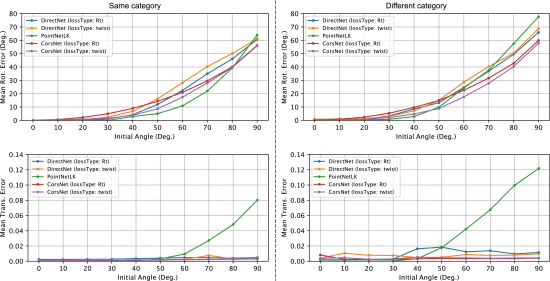

## Conclusions

The superiority of the proposed method has been proven qualitatively and quantitatively. CorsNet $\boldsymbol{Loss}_{v3}$ and CorsNet $\boldsymbol{Loss}_{v4}$ ware appreciably more accurate thanCorsNet $\boldsymbol{Loss}_{v1}$ and CorsNet $\boldsymbol{Loss}_{v2}$, depending on whether the correspondence loss is included in the loss function. The following two figure shows the registration results for the methods tested. Only the proposed method (CorsNet) successfully aligns the point clouds without falling into the local minimum, especially where the input point clouds include the repeating structures. 

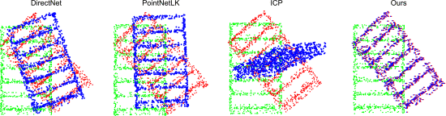

The authors suppose that this is because only the proposed method links the local features to the global features, making the most of the local and global point cloud information.

# Learning Deep NBNN Representations for Robust Place Categorization

*IEEE ROBOTICS AND AUTOMATION LETTERS, VOL. 2, NO. 3, JULY 2017*

## Introduction

An important aspect of human-robot interaction, is the ability of artificial agents to understand the way humans think and talk about abstract spatial concepts. To do this, an autonomous agent has to extract information from its sensor to assign a semantic label to a specific place. In particular, this work focuses on assign label to images. The most important challenges in identifying places come from the complexity of the concepts to be recognized and from the variability of the conditions in which the images are captured. In fact,  scenes from the same category may differ significantly, while images corresponding to different places may look similar. The historical take on these issues has been to model the visual appearance of scenes considering a large variety of (shallow) learning models (e.g. SVMs, Random Forests), but approaches based on learning deep representations have become mainstream. Some work, like [19], demonstrated the benefits derived from feature extraction through convolutional deep neural networks. Subsequent studies demonstrated the benefits of region-based approaches (i.e. considering only specific image parts) in combination with descriptors derived from CNNs, such as to obtain models which are robust to viewpoint changes and occlusions. Other successfully works tried to bring back the notion of localities into deep networks, e.g. by designing appropriate pooling strategies or by casting the problem within the Image-2-Class (I2C) recognition statements, with a high degree of success. Despite this, these methods implements the CNN feature extraction and the classifier learning as two separate modules. This leads to two drawbacks: first, choosing heuristically the relevant localities means concretely cropping parts of the images before feeding them to the chosen features extractor. Second, it would be desirable to fully exploit the power of deep networks by directly learning the best representations for the task at hand, rather than re-use architectures trained on general-purpose databases like ImageNet. This work propose an approach for semantic place categorization which exploits local representations within a deep learning framework. The method is inspired by the recent work [18], which demonstrates that, by dividing images into regions and representing them with CNN-based features, state-of-the-art scene recognition accuracy can be achieved by exploiting an I2C approach, namely a parametric extension of the Naıve Bayes Nearest Neighbor (NBNN) model. The deep architecture for semantic scene classification seamlessly integrates the NBNN and CNN frameworks. We automatize the multi-scale patch extraction process by adopting a fully-convolutional network, guaranteeing a significant advantage in terms of computational cost over two-steps methods. This is the first attempt to fully unify NBNN and CNN, building a network in which the NBNN error is back-propagated to the CNN in a unified end-to-end training. 

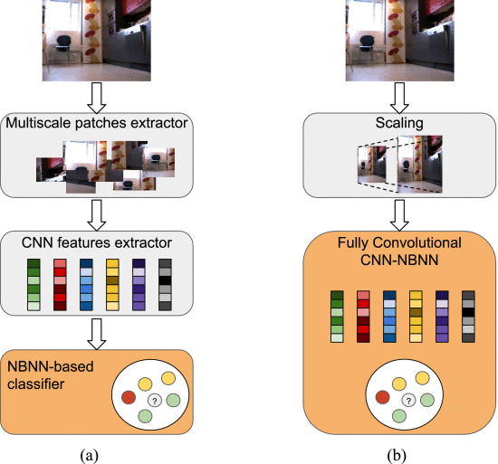

## Proposed method

As represented in the figure above, images are decomposed into multiple regions (represented with CNN features) and a part-based classifier is used to infer the labels associated to places. However, differently from previous works, the proposed approach unifies the feature extraction and the classifier learning phases. Since this framework is derived from previous NBNN-based works, it is important to give an overview of this method. 

### Naıve Bayes Non-Linear Learning 

Let ${\mathcal X}$ denote the set of possible images and let ${\mathcal Y}$ be a finite set of class labels, indicating the different scene categories. The goal is to estimate a classifier $f : {\mathcal X} \rightarrow {\mathcal Y}$ from a training set ${\mathcal T} \subset {\mathcal X} \times {\mathcal Y}$. The NBNN method works under the assumption that there is a an intermediate Euclidean space $Z$ and a set-valued function $\phi$ that abstracts an input image $x \in {\mathcal X}$ into a set of descriptors in ${\mathcal Z}$, i.e. $\phi(x) \subset {\mathcal Z}$.  For instance, the image could be broken into patches and a descriptor in ${\mathcal Z}$ could be computed for each patch. Given a training set ${\mathcal T}$, let $\Phi_y({\mathcal T})$ be the set of descriptors computed from images in ${\mathcal T}$ having labels $y \in {\mathcal Y}$, i.e. $\Phi_y({\mathcal T}) = \{\phi(x): x \in {\mathcal X}, (x, y) \in {\mathcal T}\}$ . The NBNN classifier $f_{NBNN}$ is given as follows:

$\begin{equation} f_\mathtt {NBNN}(x; {\mathcal T})=\text{arg min}_{y\in {\mathcal Y}}\sum _{z\in \phi (x)}d(z,\Phi _y({\mathcal T}))^2\,, \end{equation}$

where $d(x, {\mathcal S}) = \inf\{\| z − s\|_2 : s \in {\mathcal S}\}$ denotes the smallest Euclidean distance between $z$ and an element of $  {\mathcal S} \subset {\mathcal Z}$. $f_{NBNN}$ has the drawback of being expensive at test time, due to the nearest-neighbor search. A possible way to reduce the complexity consists in learning a small, finite set ${\mathcal W}_y \subset {\mathcal Z}$ of representative prototypes for each class $y \in {\mathcal Y}$ to replace $\Phi_y({\mathcal T})$. This idea generates the NBNL (Naıve Bayes Non-Linear Learning). NBNL is developed by replacing $\Phi_y({\mathcal T})$ with the set of prototypes ${\mathcal W}_y$ and by assuming ${\mathcal Z}$ to be restricted to the unit ball. Under the latter assumption the bound $d(z, {\mathcal S})^{2} = 2 - \omega(z, {\mathcal S}) $ can be derived, where 

$\begin{equation} \omega (z, {\mathcal S})= \left(\sum _{s\in {\mathcal S}}|\langle z,s\rangle |_+^{q}\right)^{1/q}\,. \end{equation}$

Here, $\langle \cdot \rangle$ denotes the dot product, $q \in [1, +\infin]$ and $[x]_+ = \max(0, x)$. Finally, the NBNL is defined as follows (substituting $d()^{2}$)

$\begin{equation} f_\mathtt {NBNL}(x; {\mathcal W})=\text{arg max}_{y\in {\mathcal Y}}\sum _{z\in \phi (x)}\omega (z, {\mathcal W} _y)\,. \end{equation}$

In order to learn the prototypes ${\mathcal W}_y$ for each $y \in {\mathcal Y}$, each descriptor extracted from an image is promoted to a training sample.

 

# Bibliography

[1] Niko Sünderhauf, Oliver Brock, Walter Scheirer, Raia Hadsell, Dieter Fox, Jürgen Leitner, Ben Upcroft, Pieter Abbeel, Wolfram Burgard, Michael Milford, Peter Corke, "The Limits and Potentials of Deep Learning for Robotics", eprint arXiv:1804.06557, April 2018

[2] A. Giusti *et al*., "A Machine Learning Approach to Visual Perception of Forest Trails for Mobile Robots," in *IEEE Robotics and Automation Letters*, vol. 1, no. 2, pp. 661-667, July 2016, doi: 10.1109/LRA.2015.2509024.

[3] P. Santana, L. Correia, R. Mendonça, N. Alves, and J. Barata, "Tracking natural trails with swarm-based visual saliency," J. Field Rob., vol. 30, no. 1, pp. 64–86, 2013.

[4] M. Chancán, L. Hernandez-Nunez, A. Narendra, A. B. Barron and M. Milford, "A Hybrid Compact Neural Architecture for Visual Place Recognition," in *IEEE Robotics and Automation Letters*, vol. 5, no. 2, pp. 993-1000, April 2020, doi: 10.1109/LRA.2020.2967324.

[5] A. Magassouba, K. Sugiura, A. Trinh Quoc, and H. Kawai, "Understanding natural language instructions for fetching daily objects using GAN-based multimodal target-source classification," IEEE Robot. Autom. Lett., vol. 4, no. 4, pp. 3884–3891, Oct. 2019.

[6] H. Fukui, T. Hirakawa, T. Yamashita, and H. Fujiyoshi, "Attention branch network: Learning of attention mechanism for visual explanation," in Proc. CVPR, 2019, pp. 10 705–10 714.

[7] J. Hatori et al., "Interactively picking real-world objects with unconstrained spoken language instructions," in Proc. IEEE ICRA, 2018, pp. 3774–3781.

[8] A. Palffy, J. Dong, J. F. P. Kooij and D. M. Gavrila, "CNN Based Road User Detection Using the 3D Radar Cube," in *IEEE Robotics and Automation Letters*, vol. 5, no. 2, pp. 1263-1270, April 2020, doi: 10.1109/LRA.2020.2967272. 

[9] W. Liu et al., "SSD: Single shot multibox detector," Lecture Notes in Computer Science (including subseries Lecture Notes in Artificial Intelligence and Lecture Notes in Bioinformatics), vol. 9905 LNCS, pp. 21–37, 2016.

[10] R. Prophet et al., “Pedestrian classification with a 79 GHz automotive radar sensor,” in Proc. 19th Int. Radar Symp., 2018, pp. 1–6.

[11] O. Schumann, M. Hahn, J. Dickmann, and C. Wöhler, "Comparison of random forest and long short-term memory network performances in classification tasks using radar," in Proc. Sensor Data Fusion: Trends, Solutions, Appl., 2017, pp. 1–6.

[12] A. Kurobe, Y. Sekikawa, K. Ishikawa and H. Saito, "CorsNet: 3D Point Cloud Registration by Deep Neural Network," in *IEEE Robotics and Automation Letters*, vol. 5, no. 3, pp. 3960-3966, July 2020, doi: 10.1109/LRA.2020.2970946.

[13] P. J. Besl and N. D. McKay, "Method for registration of 3-d shapes," in Proc. Sensor Fusion IV: Control Paradigms Data Struct., 1992, vol. 1611, 1992, pp. 586–607.

[14] C. R. Qi, H. Su, K. Mo, and L. J. Guibas, "Pointnet: Deep learning on point sets for 3d classification and segmentation," in Proc. IEEE Conf. Comput. Vis. Pattern Recognit., 2017, pp. 652–660.

[15] Y. Aoki, H. Goforth, R. A. Srivatsan, and S. Lucey, "Pointnetlk: Robust & efficient point cloud registration using pointnet," IEEE Conf. Comput. Vis. Pattern Recog. (CVPR), Jun. 2019.

[16] Z. Wu et al., "3D shapenets: A deep representation for volumetric shapes," in Proc. IEEE Conf. Comput. Vis. Pattern Recognit., 2015, pp. 1912–1920.

[17] M. Mancini, S. R. Bulò, E. Ricci and B. Caputo, "Learning Deep NBNN Representations for Robust Place Categorization," in *IEEE Robotics and Automation Letters*, vol. 2, no. 3, pp. 1794-1801, July 2017, doi: 10.1109/LRA.2017.2705282.

[18]  I. Kuzborskij, F. Maria Carlucci, and B. Caputo, "When naive bayes nearest neighbors meet convolutional neural networks," in Proc. IEEE Conf. Comput. Vis. Pattern Recognit., 2016, pp. 2100–2109.

[19] A. Krizhevsky, I. Sutskever, and G. E. Hinton, "Imagenet classification with deep convolutional neural networks," in Proc. 25th Int. Conf. Neural Inf. Process. Syst., 2012, pp. 1097–1105.

[20] Y. Jia et al., "Caffe: Convolutional architecture for fast feature embedding," in Proc. 22nd ACM Int. Conf. Multimedia, 2014, pp. 675–678.

[21] K. Simonyan and A. Zisserman, "Very deep convolutional networks for large-scale image recognition," 2014, arXiv preprint arXiv: 1409.1556.

[22] C. Szegedy et al., "Going deeper with convolutions," in Proc. IEEE Conf. Comput. Vis. Pattern Recognit., 2015, pp. 1–9.

