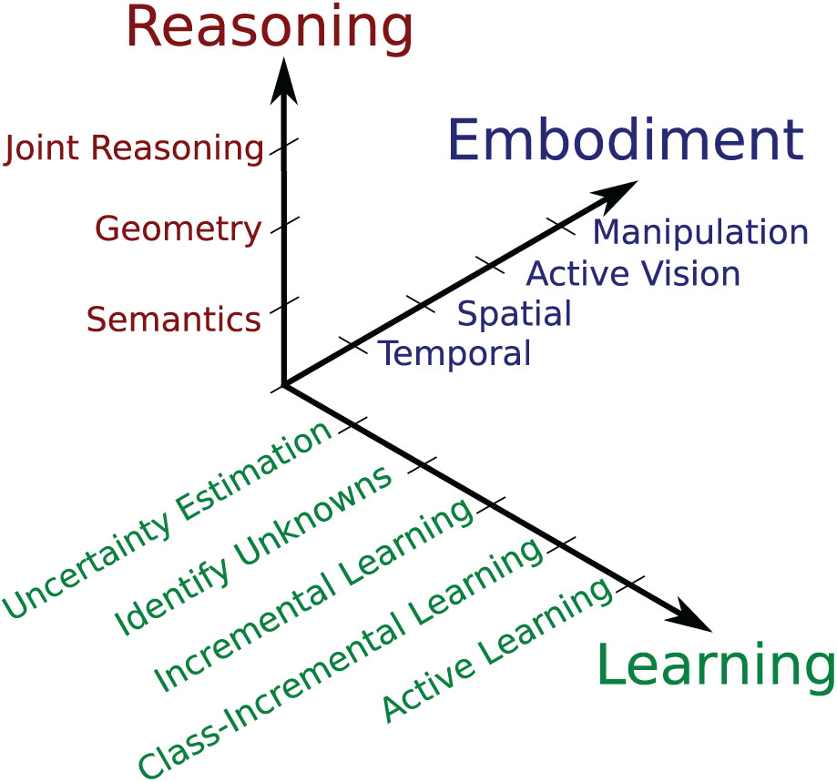
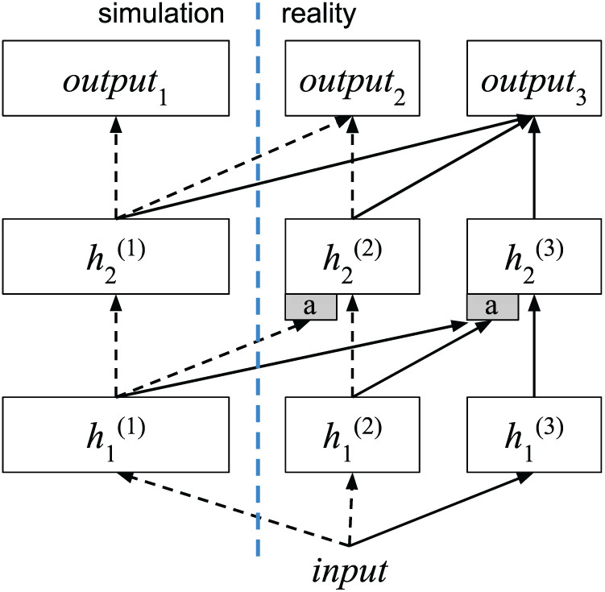
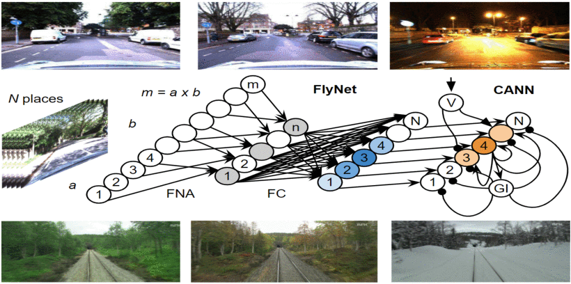
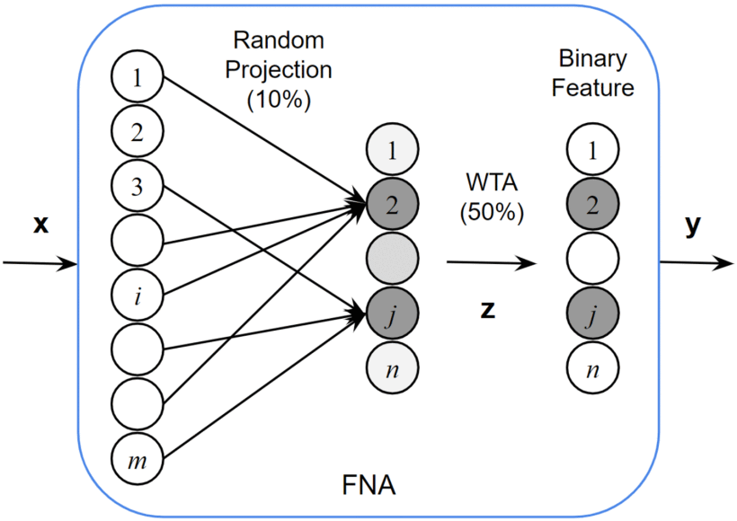

# Project of Intelligent Systems
This report contains 10 summarized papers. The main topic is deep learning applied to robotics 

# Introduction

In the last few years, advances in technologies and research have had a great impact on the development of robotics. The robots are employed every day in a large variety of contexts. They substitute humans in those activities that can be performed more quickly and precisely. An example is manufacturing when the production process is automatized using artificial agents to improve productivity and reduce costs. In this case, the robots are fixed manipulators with a limited range of motions, that depends on where it is bolted down. This characteristic strongly limits the agent's possibilities. Generally, a fixed robot is programmed to perform a single precise task and it operates in a controlled environment. This means that the algorithm foresees every possible situation and often it is coded as a state machine. In contrast, mobile robots would be able to travel within the environment in which they operate, applying their talents wherever it is most effective. Thank mobility, the robotics applications become almost limitless. Some of them are healthcare, entertainment, and rescue. Mobile robots are also employed in those tasks that are impossible or too dangerous for humans, as the exploration of hostile environments: a building on fire, the seabeds, or the surface of another planet. These robots can be controlled by humans or can be autonomous. The firsts are controlled through remote controls while the seconds perceive the environment and move autonomously according to their task, without human intervention. The main problem that a mobile robot has to solve is how to move inside the environment. The first aspect is the *motion control*. Each robot has a different locomotion system, specific for the characteristics of the environment in which it moves. Given its low-level complexity, the motion actions are performed by a specific software component. To perform the motion control task is necessary to use the kinematics: the study of how the robot's mechanical systems behave. To define the kinematics of a robot, it is necessary to define a geometrical model (specific for the mechanical characteristics of the locomotion system) that allows expression of robot motion in a global reference frame and in the robot’s local reference frame. Using this notation, it is possible to define the robot's kinematics model that describes the movements and their constraints as a function. Through kinematics, it is resolved the significant challenge of *position estimation*. The next step is the *perception*. An autonomous system has to acquire knowledge about the environment. This is done by taking measurements using various sensors and then extracting information from those measurements. With this information, a mobile robot can determine its position in the environment. This activity is called *localization*. The last step for an autonomous mobile agent is *navigation*. Given partial knowledge about its environment and a goal position or a series of positions, navigation is the ability of the robot to act based on its knowledge and sensor values to reach its goal positions as efficiently and as reliably as possible. There are two main sub-task of navigation: *path planning* and *obstacle avoidance*. The first involves identifying a trajectory that will cause the robot to reach the goal location when executed. The second consists of modulating the trajectory of the robot in order to avoid collisions. Using the techniques explained before, an autonomous mobile robot is able to robustly navigate inside an environment to perform its tasks. However, a mobile robot operates in a highly non-deterministic context and the conventional algorithms often are not suitable or not robust enough. In the real world, in fact, there are a lot of different tasks that are too complicated to be modeled by a conventional algorithm. Some problems indeed may have a wide amount of data difficult to analyze. In this case, build a specific algorithm means to understand the complex patterns and the hidden correlations between the data. Instead, other tasks may be influenced by a lot of external factors that generate a large quantity of similar but different data. These factors are not easy to model, especially considered all together, and often they are not a priori known. This means that an algorithm performs well only in a controlled environment, that respects specific preconditions. On the other hand, if it is applied in the real world, the algorithm may encounter data that it cannot correctly analyze. A particular field of Computer Science is particularly suitable to solve these situations: *machine learning* (ML). It represents a family of algorithms that learn automatically through experience. These algorithms are not designed for a specific task but they are general purposes so they can be used to solve each type of task. The principle behind machine learning is the following: each real phenomenon can be modeled as an unknown mathematical function which can be approximate by a machine learning algorithm. In this work, the focus is posed on *deep learning* and its application to robotics. Deep learning is based on artificial neural networks, inspired by the biological neural network that composed the animal brains. In the following sections are resumed some papers that apply deep learning to robotics. Each of them specifies the article title, the name of the journal where it has been published, and the publication year. For each article is summarized the approach proposed, the innovation with respect to the literature and the achievements.

# The limits and potentials of deep learning for robotics

*THE INTERNATIONAL JOURNAL OF ROBOTICS RESEARCH 2018, Vol. 37(4–5) 405–420*

## Introduction

A robot is an inherently active agent that interacts with the real world and often operates in uncontrolled or detrimental conditions. Mistakes can lead to potentially catastrophic results, like put human lives at risk, e.g. if the robot is a driverless car. The application of deep learning in robotics, therefore, motivates research questions that differ from those typically addressed in other domains. How much trust can we put in the predictions of a deep learning system when misclassifications can have catastrophic consequences? How can we estimate the uncertainty in a deep network’s predictions and how can we fuse these predictions with prior knowledge and other sensors in a probabilistic framework? How can we generate enough high-quality training data? We can obtain these data in real-world scenarios or we can obtain them using data augmentation through simulation? Is there a fundamental difference between model-driven and data-driven problem-solving? This paper explores some of the challenges, limits, and potentials for deep learning in robotics.

## Challenges for deep learning in robotic vision

*Robotic vision* differs from *computer vision* in several aspects. In particular, the latter is a part of the first. A robot is an active agent that perceives the world with its different sensors, builds a coherent model of the world, and updates this model over time, but ultimately a robot has to make decisions, plan actions, and execute these actions to fulfill a useful task. In fact, for robotic vision, perception is only one part of a more complex system. In a simplified view, whereas computer vision takes images and translates them into information, robotic vision translates images into actions. This fundamental difference between robotic vision and computer vision motivates a number of research challenges along three conceptually orthogonal axes: *learning*, *embodiment*, and *reasoning*. We position individual challenges along these axes according to their increasing complexity, and their dependencies. 

### Learning challenges

Along this axis, we position challenges that are specific for (deep) machine learning in a robotic vision context.

**Uncertainty estimation**

It is important that deep learning systems can reliably estimate the uncertainty in their predictions. The robot has to treat a neural network in the same way as other sensors, also using Bayesian techniques to fuse the network’s predictions with prior knowledge to accumulate information over time. Typically a deep learning model returns scores that are not calibrated probabilities so not useable in a Bayesian sensor fusion framework. 

**Identify unknowns**

A common assumption in deep learning is that trained models will be deployed under *closed-set* conditions. However, robots often have to operate in ever-changing, uncontrolled real-world environments, and they will inevitably encounter data not covered by the training data. In these *open-set* conditions, it is crucial to identify unknowns with high confidence.

**Incremental learning**

A robotic vision system should be able to learn from new training samples of known classes during deployment, upgrading its internal representations accordingly.

**Class-incremental learning**

A robot, therefore, needs the capability to extend its knowledge and efficiently learn new classes of interest without forgetting the previously learned ones. Current techniques for class-incremental learning still rely on supervision in the sense that the user has to specifically tell the system which samples are new data.

**Active learning**

A robot should be able to select the most informative samples for incremental learning techniques on its own. In order to minimize the interaction with the humans, the robotic system can also comprise retrieving annotations from other sources such as the web.

### Embodiment challenges

**Temporal embodiment**

A robotic vision system perceives a stream of consecutive and therefore strongly correlated images. The potential of temporal embodiment to improve the quality of the perception process for object detection or semantic segmentation is currently rarely utilized. A robotic vision system that uses its temporal embodiment can, for example, accumulate evidence over time or exploit small viewpoint variation. A challenging aspect of the temporal embodiment is that the appearance of scenes changes over time. An environment can comprise dynamic objects which move inside it. Besides, an environment can also change its appearance according to different lighting conditions (day/night), structural changes in objects (summer/winter).

**Spatial embodiment**

The camera of a robotic system is spatially embodied and it will observe the scene according to the robot's movements. This fact poses both challenges and opportunities to a robotic vision system: it can help to disambiguate its semantic properties, improve depth perception, or segregate an object from other objects or the background in cluttered scenes. On the other hand, occlusions can alter or changes the visual perception. 

**Active vision**

One of the biggest advantages of a robot is the potential to control the camera, move it, and change its viewpoint independently from the robot's movements. In this way, a dynamic robotic vision system can improve its perception confidence, resolve ambiguities, and mitigate the effect of occlusions or reflections.

**Manipulation for perception**

As an extension of active vision, a robotic system could manipulate the scene to improve its perception. For example, a robot could move occluding objects or move an object to see its occluded faces.

### Reasoning challenges

Von Helmholtz (1867) formulated the idea that humans use unconscious reasoning when processing visual information, in order to inference concepts or make conclusions. The following searches investigate these unconscious mechanisms and reformulated them in a Bayesian inference framework.

**Reasoning about object and scene semantics**

The world around us contains many semantic regularities that humans use to aid their perception: objects tend to appear more often in a certain context, some objects tend to appear in groups, some objects rarely appear together in a scene, and so on. If these semantic regularities can be used by a vision system as prior knowledge, we can expect an improved and more robust vision framework.

**Reasoning about object and scene geometry**

Many applications in robotics require knowledge about the geometry of individual objects, or the scene as a whole. Estimating the 3D structure of scenes or objects from multiple views without having depth information is a widely researched topic. A robot, differently from a classical approach, has to perform this task in cluttered scenes, where the objects are not clearly separated. A robot needs the ability to express uncertainty in the inferred object shape and it should be able to exploits its embodiment to move the camera to collect new and more useful information. Inference over the geometry of the whole scene is related also to object-based simultaneous localization and mapping (SLAM).

**Joint reasoning about semantics and geometry**

The final reasoning challenge for a robotic vision system, therefore, is the ability to reason jointly about the semantics and the geometry of a scene. Semantics and geometry can help each other: a tightly coupled inference approach can be advantageous compared to two systems that work separately.

## The evaluation method for deep learning models applied to robotics

Normally the good deep learning performance is not reached when the models are used in real environments. The evaluation method used in computer vision fails when applied in robotics: a robot has to interact with a dynamic environment and not with a simple set of images downloaded from the Internet. When a statistic report indicates that a dataset has been solved, it does not necessarily mean that the problem itself has been solved. The available datasets often are not able to able to correctly evaluate the performance of a robotic deep learning model. One of the reasons is the datasets' inability to give to the model information about the unknowns aspect of real environments. In particular, *Open set recognition* refers to scenarios where incomplete knowledge of the world is present at training time. This implies that unknown classes can be submitted to the model during its operation. What is needed is a new class of machine learning algorithms that minimize the risk of the unknown. To do this, updated evaluation protocols are also needed. These protocols have to incorporate data that is both know and unknown to a model. Another important aspect is the systematic study of the performance of a recognition model across an exhaustive range of object appearances. To better understand this mechanisms, inner in the humans' visual system, psychophysics discipline can be used. Psychophysics investigates the relationship between physical stimuli and the sensations and perceptions they produce. This concept can be translated into the field of deep learning: we would like to know under what conditions a machine learning model is able to operate successfully, as well as where it begins to fail. But how exactly can Psychophysics be applied to deep models? One possibility is through a computational pipeline that is able to perturb the data at a massive scale (e.g. millions of images per image transformation being studied) and submit them to a model, studying its performance through the item–response curve. The key to interpreting the results is the ability to identify the model’s preferred view. The preferred view concept derives from vision science, which has established that humans possess an internalized canonical view (the visual appearance that is easiest to recognize) for individual object classes. Similarly, recognition models have one or more preferred views of an object class, each of which leads to a maximum (or minimum) score output. The psychophysics progresses support a growing trend in robotics and computer vision: simulation using rendered graphics. The models' performance can be assessed by comparing the respective item–response curves. Importantly, this technique can find potential gaps not only between different models but also between human and model behavior. Human performance vastly exceeds model performance even in cases where a problem has been assumed to be solved, especially comparing the item-response curves.

## The role of simulation for pixel-to-action robotics

*Deep reinforcement learning* is a new learning paradigm that is capable of learning end-to-end robotic control tasks, but its results have been demonstrated primarily in simulation, rather than on real robot platforms. Demonstrating learning capabilities on real robots remains a significant challenge: the long, data-hungry training paradigm of pixel-based deep robotic learning methods are too computationally hard to be executed by a robotic platform. On the other hand, in simulation, the training time can be greatly reduced by using dedicated hardware and parallelism paradigms. Another important difference that often separates a simulated task and its real-world analog concerns raw pixel inputs. One solution is to use transfer learning methods, but there exist fewer approaches for transfer from simulation to reality for robot domains. A possible solution consists of augmenting the target domain data with data from the source domain. Another approach is to use a "confusion" loss that forces the model to ignore data variations that separate the two domains. A more recent simulation-to-real solution relies on the *progressive network* architecture, which enables transfer learning through lateral connections that connect each layer of previously learned deep networks to new networks to model the gap between the two domains. The progressive networks advantages for simulation-to-real transfer are the following:

- the features learned for one task may be transferred to many new tasks;
- the columns may be heterogeneous, which may be important for solving different tasks, including different input modalities, or simply to improve learning speed when transferring to the real robot;
- progressive nets add new capacity, including new input connections, when transferring to new tasks. This is advantageous for bridging the reality gap, to accommodate dissimilar inputs between simulation and real sensors.

)

## Deep learning and physics-based models

The predominant approach to perception, planning, and control in robotics is to use approximate models of the physics underlying a robot, its sensors, and its interactions with the environment. These models require that their parameters are known with sufficient accuracy and can be tracked over time. This requirement poses overly challenging demands on system identification and perception, resulting in brittle systems. On the other hand, humans operate under intuitive rather than exact physical models. For this reason, they are capable of robustly performing a wide variety of tasks. Also, deep learning is moving in this direction: a lot of approaches forgot the use of explicit physics models, learning predictive models, and controls from raw experiences. Let's now confront the model-based and deeply learned approaches. Model-based approaches have wide applicability since the physics underlying them are universal. However, at the same time, the parameters of these models are difficult to estimate from perception. Deep learning, on the other hand, enables highly robust performance when trained on sufficiently large data sets but it does not have the general applicability of physics-based reasoning. Model-based approaches are significantly more data-efficient, related to their smaller number of parameters but the basin of convergence can be rather small. In contrast, deep learned solutions are often very fast and can have very large basins of convergence. However, they do not perform well if applied in a regime outside the training data. The following table resumes the principles just reported.

|                          | **Model-based**                                              | **Deep learning**                                           |
| ------------------------ | ------------------------------------------------------------ | ----------------------------------------------------------- |
| *Presentation*           | Explicit: based on or inspired by physics                    | Implicit: network structure and parameters                  |
| *Generality*             | Broadly applicable: physics are universal                    | Only in trained regime: risk of overfitting                 |
| *Robustness*             | Small basin of convergence: requires good models and estimates thereof | Large basin of convergence: highly robust in trained regime |
| Data efficiency          | Very high: only needed for system identification             | Training requires significant data collection effort        |
| Computational efficiency | Good in local regime                                         | Highly efficient once trained                               |

## Towards an automation of informatics

Deep learning will change the foundations of computer science. The successes of deep learning in various domains changing the algorithm design paradigm. While designing a specific algorithm requires a lot of experience and knowledge about the problem domain, machine learning techniques allow us to solve even a difficult task with little to no knowledge of the problem domain. 

**Programming versus data**

The programming paradigm is changing rapidly with the evolution of machine learning. In traditional computer science, human experts program problem-specific algorithms that require no additional data to solve a particular problem instance. On the other hand, a generic learning approach needs a large amount of data to find a computational solution automatically. The act of *programming* is replaced by *training* on the other end. The concept of the program is turned into the learning weights of the network. The programming language (the language in which a solution is coded), is replaced by network architecture, loss function, training procedure, and data.

**Does understand imply a precise approach?**

Computer programs reflect human understanding: a programmer has to understand the problem he is solving. If it is using deep learning techniques, we might say that less knowledge is required. The trend for a good programmer should be to understand the problem he is facing. To do this, often it needs to be able to use generic tools, such as deep learning, to discover problem structure. Furthermore, a programmer should understand how problems can be divided into parts: those parts for which we know the structure (and, therefore, can write algorithms for) and those for which we would like to discover the structure. 

**Generic tools might help us identify new structures**

As mentioned before, a programmer can use generic tools to acquire the knowledge needed to solve a problem and code a specific program. It might be difficult to extract this knowledge from a deep neural network but that should simply motivate researchers to develop methods for extracting this knowledge. This procedure is possible, as shown by recent experiments, but the extracted knowledge is really difficult to be used to design a specific algorithm. In addition, the neural networks further complicate this process: they simply memorize the training parameters, making so hard to extract the problem structure from them.

**Complex problems should be solved by decomposition and re-composition**

In many cases, interesting and complex problems will exhibit complex structures because they are composed of sub-problems. For many sub-problems, we already have excellent algorithmic solutions while, for many others, domain-specific programs are outperformed by deep neural networks. The re-composition can be achieved with differentiable versions of existing algorithms that are compatible solutions obtained with back-propagation

**Decomposability of problems**

A problem is called *decomposable* or *near-decomposable* if there is little complexity in the interactions among its sub-problems and most of the complexity is handled within those sub-problems. For example, the brain is not decomposable because the interactions between its components still contain much of the complexity of the original problem. Despite decomposition helps to dominate the problem complexity, this is not true for deep neural networks. In fact for end-to-end models giving up strict boundaries between sub-problems improves their solution. The authors suspect that there are optimal factorizations of problems for a defined task, agent, and environment. Despite this, factorization may not lead to simple interfaces between sub-problems but certainly facilitates finding an optimal solution.

**Automating programming**

Programming should be easy to automate. If we can successfully apply generic methods to complex problems, extract an algorithmic knowledge from the resulting solutions, use the resulting algorithms to solve sub-problems of the original problem, thereby making that original problem more easily solvable, and so forth, then we can also imagine an automated way of deriving computer algorithms from problem-specific data. A key challenge will be the automatic decomposition or factorization of the problem into suitably solvable sub-problems. This view raises some fundamental questions about the differences between *programs* in programming and *weights* in deep learning. Programs and weights, in this view, are different instances of the same thing: there is no qualitative difference between them. It seems plausible that when parameters are so specific we can call the program, but the reverse is also true. It is possible that other problems do not have algorithmic characteristics and can only be solved in a data-driven way.

**Priors to reduce the amount of data**

The process for acquiring the data can be very costly, especially when these data have to be acquired from interaction with the real world, as is the case in robotics. It will then become necessary to reduce the required amount of data by incorporating appropriate priors into learning. These priors reduce all possible interpretations of data to only those consistent with the prior. 

## Conclusions

The robotics community had accepted deep learning as a very powerful tool and begun to utilize and advance it. Despite this, the authors hope to see more integrated approaches in the future: robots that learn to utilize their embodiment to reduce the uncertainty in perception, decision making, and execution. Robots that learn complex multi-stage tasks. Robots that learn to discover and exploit the rich semantic regularities and geometric structure of the world. It is necessary to keep in mind that robotic perception, robotic learning, and robotic control are tasks that continue to pose severe challenges to the techniques typically applied.

# A Machine Learning Approach to Visual Perception of Forest Trails for Mobile Robots

*IEEE ROBOTICS AND AUTOMATION LETTERS, VOL. 1, NO. 2, JULY 2016*

## Introduction

This article studies the problem of perceiving forest or mountain trails from a single monocular image acquired from the viewpoint of a robot. Autonomously following a man-made trail is challenging for robotics. Many robot types, including wheeled, tracked, and legged vehicles, are capable of locomotion along real-world trails. Moreover, Micro Aerial Vehicles (MAVs) flying under the tree are a compelling and realistic option made possible by recent technological advances. One of the innovations introduced by this article is that the robot used for the experiments is a quadrotor: a drone with four rotors. In order to follow a trail, a robot has to perceive where the trail is, then react in order to stay on the trail. The robot input is a monocular image from a forward-looking camera. Perceiving real-world trails in these conditions is an extremely difficult and interesting pattern recognition problem. Computer Vision and Robotics literature mainly focused on paved road and forest/desert road perception. The latter is a significantly more difficult problem: unpaved roads are normally much less structured than paved ones. Their appearance is very variable and often boundaries are not well defined. In addition, their surface appearance can change very frequently, their shape and width are not as constrained, they often seamlessly blend with the surrounding area. Previous works deal with the task of perceiving trails as a segmentation problem, aiming to determine which areas of the input image corresponding to the image of the trail. To do this, it is necessary to classify the visual features that characterize a trail. All of these techniques are conceptually similar to image saliency. A *saliency map* is an image that shows for each pixel (of the original image) how much such pixel visually "stands out" from the rest. This information, which by itself is expected to be very noisy, is aggregated in order to infer the trail position and direction in the image. In this work, the authors follow a different approach and cast the trail perception problem as an image classification task. The robot estimates the approximate direction of the trail with respect to the direction of view by adopting a supervised machine learning approach based on Deep Neural Networks (DNNs). One of the advantages of DNNs for supervised image classification is generality: in fact, features are learned directly from data and do not have to be chosen or modeled by the algorithm developers for the specific problem. Deep learning is used also for obstacle avoidance. Previous work shows how imitation learning can be used to steer a quadrotor to avoid trees in an outdoor environment. The controller is previously trained by manually piloting the robot for a short time. However, the visual perception task is harder, requiring a more powerful classifier to be trained with a significantly larger training dataset obtained offline.

## Proposed method

### Problem formulation

The robot consists of a MAV with a monocular camera, fixed in front of it. The drone flies with a height similar to the average height of a person (approximately 1.7 meters). The input is an image acquired by the camera. The main goal is to remain on the trail analyzing the image using a deep learning module. There are considered three different classes which correspond to three different actions that the robot should implement in order to remain on the trail:

- **Turn Left (TL):** if −90◦ < α < −β; the trail is heading towards the left part of the image
- **Go Straight (GS):** if −β ≤ α < +β; the trail is heading straight ahead, at least in the close range
- **Turn Right (TR):** if +β ≤ α < +90◦; the trail is heading towards the right part of the image

With β = 15◦. 

### Dataset

Recognize a trail is a very hard task and the learning machine needs a large and well-formed dataset to perform this task effectively. Such a dataset does not exist and the authors had to create it from scratch. A hiker was equipped with three head-mounted cameras: one pointing 30◦ to the left, one pointing straight ahead, and one pointing 30◦ to the right. The fields of view of the three cameras partially overlap and cover approximately 180 degrees. The hiker then swiftly walks a long trail, by taking care of always looking straight along its direction of motion. The dataset is composed of the images acquired by the three cameras, labeled as follows: all images acquired by the central camera are of class GS, those acquired by the right camera are of class TL and the others (acquired by the left camera) make up the TR class. The dataset is composed of 8 hours of 1920 × 1080 30fps video acquired using three GoPro Hero3 Silver cameras and covers approximately 7 kilometers of hiking trails acquired at altitudes ranging from 300 m to 1200 m, different times of the day and weather. The dataset has been split into disjoint training (17,119 frames) and testing (7,355 frames) sets.

### Deep neural network

The authors implement the trail perception module as DNN (deep neural network), which is a feed-forward network built using successive pairs of convolutional and max-pooling layers, followed by several fully connected layers. To improve the network performances, the training set is augmented by synthesizing left/right mirrored versions of each training image. Additionally, mild affine distortions (±10% translation, ±15◦ rotation, ±10% scaling) are applied to training images to further increase the number of samples. The DNN is trained using backpropagation for 90 epochs, with a learning rate initially set to 0.005, then scaled by a factor of 0.95 per epoch. The free parameters (weights) are initialized with random numbers from a uniform distribution in the range [−0.05, 0.05] and they are optimized using stochastic gradient descent. The network has an input layer formed by a matrix of 3 × 101 × 101 neurons. To fit with the input layer, the images are first anisotropically resized (with an anti-aliasing technique) to a size of 101 × 101 pixels. The pixels intensity are rescaled to the range [-1, +1]. The DNN's output layer has 3 neurons, one for each of the three classes TL, TR, GS.

### Experimental results

For the three-class classification problem, the absolute accuracy metric is computed to evaluate the model performances. To have a more robust performance evaluation, the authors consider a derived two-class classification problem. The resulting problem consists in determining if an image is of class GS or not. There are calculated accuracy, corresponding precision (the proportion of positive classifications that are actual positives), recall (the proportion of the actual positives that are identified correctly), and the area under the ROC curve. The authors compare the DNN performance to three alternatives:

- **Simple Saliency-based Model:** it is computed a saliency map of the input frame, based on the image hue. The saliency map is discretized to 16 × 9 blocks, and the average saliency for each block yields a 144-dimensional feature vector. An SVM model with an RBF kernel is learned from the training set to map this feature vector to the three-class: TL, GS, and TR.
- **The method by Santana et al:** this algorithm is explained in [12] and it is applied to the dataset images (50 iterations per frame). Its output trail soft segmentation is sampled at each of the testing frames.
- **Two human observers:** each of which is asked to classify 200 randomly sampled images from the testing set in one of the three classes.

The obtained results are reported it the following tables.

|              | **DNN** | **Saliency** | **[2]** | **Human1** | **Human2** |
| ------------ | ------- | ------------ | ------- | ---------- | ---------- |
| **Accuracy** | 85.2%   | 52.3%        | 36.5%   | 86.5%      | 82.0%      |

|               | **DNN** | **Saliency** | **[2]** | **Human1** | **Human2** |
| ------------- | ------- | ------------ | ------- | ---------- | ---------- |
| **Accuracy**  | 95.0%   | 73.6%        | 57.9%   | 91.0%      | 88.0%      |
| **Precision** | 95.3%   | 60.9%        | 39.8%   | 79.7%      | 84.0%      |
| **Recall**    | 88.7%   | 46.6%        | 64.6%   | 95.1%      | 81.6%      |
| **AUC**       | 98.7%   | 75.9%        | -       | -          | -          |

### Conclusion

The model has good performance, even when compared to those of humans. However, problems arise when applying this model in the real world. The authors implemented this model in a real drone, with a camera that captures frames with a resolution of 752 × 480 pixels. The main problem is the much lower image quality acquired by the quadrotors’ cameras as compared to the GoPro's images in the training dataset. This yielded a lower performance of the classifier compared to the testing dataset. This was especially apparent in situations with strong sky-ground contrast. Another problem is related to the trail width: the robot is often unable to negotiate trails if there is not enough free space beside the trail centerline. Despite this, on wide trails with even lighting conditions, the robot was able to successfully follow the trail for a few hundreds of meters.

# A Hybrid Compact Neural Architecture for Visual Place Recognition

*IEEE ROBOTICS AND AUTOMATION LETTERS, VOL. 5, NO. 2, APRIL 2020*

## Introduction

Performing visual place recognition (VPR) reliably is a challenge for any robotic system or autonomous vehicle operating over long periods of time in real-world environments. Convolutional neural networks (CNN) have been applied to the field of VPR with great success, typically using dedicated hardware: the GPUs. However, classical CNNs neglect any temporal information between consecutive images. However, sequence-based algorithms, such as SeqSLAM, matching two or more sequences of images to perform VPR. There are two main deep learning models that can be used to capture sequence patterns: *computer-science-oriented* and *neuroscience-oriented* models. In recent researches, recurrent neural networks (RNN) are used to reproduce the multi-scale spatial representation of an environment. While the results are promising, these computer-science-oriented systems are tested only in small synthetic environments, and the integration with neuroscience-oriented recurrent models such as continuous attractor neural networks (CANN) is not well explored. An attractor network is a network of nodes (i.e. neurons), often recurrently connected, whose time dynamics settle to a stable pattern. A pattern can be stationary, time varying (i.e. cyclic) or chaotic. The particular pattern which network settles to is called its *attractor*. In neuroscience theory, different kinds of attractor neural networks have been associated with different functions, such as memory, motor behavior, and classification. More in detail, a continuous attractor network is a special type of attractor network, which models a non-linear dynamical system. A dynamical system consists in a *state place*, which its coordinates describe the state at any instance, and a *dynamical role* that specifies the immediate future of all state variables. For example the state of a pendulum is its angle and angular velocity, and the evolution rule is Newton's equation *F*=*m^a*. An *attractor* can be discrete (a discrete set of points) or continuous (a continuous object embedded in the state space).

In this work, the authors propose a hybrid neural network that incorporates both computer-science- and neuroscience-oriented models to perform VPR task. Their approach comprises two key components: FlyNet, a compact neural network, and a 1-d CANN as temporal model that encodes sequences of images to perform appearance-invariant VPR using real data. The resulting FlyNet+CANN model achieves competitive AUC results, but with far less parameters, minimal training time and smaller computational footprint than conventional deep learning and algorithmic-based approaches.

## Previous work

To design deep-learning-based models for VPR it is necessary to explore how this activity is performed by mammalians' brain and take inspiration from it. RatSLAM is an example, this method perform visual SLAM implementing the mechanisms using by rodents' brain. Other models performs VPR following the insect brains, like ants, bees and flies, that exhibits great capacity to navigate. Place recognition in insects is, however, most likely mediated by processing within the *mushroom bodies* (MB), a pair of structure involved in classification, learning and recognition of both olfactory and visual information. Their structure has been similar to a multi-layer perceptron (MLP) network, which receive massive inputs signals from sensory lobes. These impressive capabilities, achieved with relatively small brains, make them attractive models for roboticists. For FlyNet, we take inspiration from algorithmic insights found in the fruit fly olfactory neural circuit. The authors investigate how it can be integrated with recurrent-based networks for VPR task. Classical CNN models for image recognition has good performance but they have also  undesirable characteristics. In fact, these networks are difficult to implement in real robot,due to their size and complexity. In contrast, the authors propose the usage of compact neural models such as FlyNet to alleviate these requirements. To access and exploit the power of temporal information in many applications, researchers have developed a range of RNN. Another approach, implementing by RatSLAM, uses incorporated multi-dimensional CANN models with pre-assigned weights and structure. There exist other non-neural techniques, like SeqSLAM, that match sequences of pre-processed frames to provide an estimate of place. In this work, the authors attempt to developing a new bio-inspired, hybrid neural network for VPR tasks based on insect brain architectures such as FlyNet, which is extremely compact and can incorporate the filtering capabilities of a 1-d CANN to achieve competitive localization results.

## Proposed method

### FlyNet algorithm

The FlyNet proposed in this works is inspired by the *fly algorithm*. The Drosophila's small brain identifies odors by assigning similar neural activity patterns to similar input odors. The neural networks is composed by 4 layers (the input layer, two hidden layer and the output layer). The network works as follow. A binary, sparse random matrix (*random projection*) connects the input layer to the second layer: each neuron receives and sums about 10% of the input neurons. This mechanism is also used to connect the second and third layers, but the number of neurons in the third layer is the same as the output one. Finally, using a WTA (winner-take-all) circuit, the third layer's neurons are mapped to the output layer, setting the first 5% with the high value to 1 and the rest to 0. The input layer generate a specific binary identifier for the input odor. The *FlyNet Algorithm* (FNA) proposed in this work is a mapping of the fly algorithm for vision purpose. The only difference is the WTA circuit, which is set to consider true the first 50% of the neurons with the high neurons.

The following table reports the compact version of the FNA, seen without the network model. 

### FlyNet models

The authors implement a range of VPR models, using FNA and a module with temporal filtering capabilities. These network models are the following:

* **FlyNet:** it's composed by the FNA compact representation that terminates with a fully connected (FC) layer.
* **FlyNet+SeqSLAM:** it incorporates the SeqSLAM algorithm on top of our single-frame FlyNet network. This model can be compared along with the other following temporal models.
* **FlyNet+RNN:** It is a purely neural model that incorporates a RNN on top of FlyNet.
* **FlyNet+CANN:** it incorporates a variation of the CANN architecture proposed in RatSLAM, which is a 1 dimensional model, on top of the FlyNet algorithm.

# Bibliography

[1] Niko Sünderhauf, Oliver Brock, Walter Scheirer, Raia Hadsell, Dieter Fox, Jürgen Leitner, Ben Upcroft, Pieter Abbeel, Wolfram Burgard, Michael Milford, Peter Corke, "The Limits and Potentials of Deep Learning for Robotics", eprint arXiv:1804.06557, April 2018

[2] A. Giusti *et al*., "A Machine Learning Approach to Visual Perception of Forest Trails for Mobile Robots," in *IEEE Robotics and Automation Letters*, vol. 1, no. 2, pp. 661-667, July 2016, doi: 10.1109/LRA.2015.2509024.

[3] P. Santana, L. Correia, R. Mendonça, N. Alves, and J. Barata, "Tracking natural trails with swarm-based visual saliency," J. Field Rob., vol. 30, no. 1, pp. 64–86, 2013.

